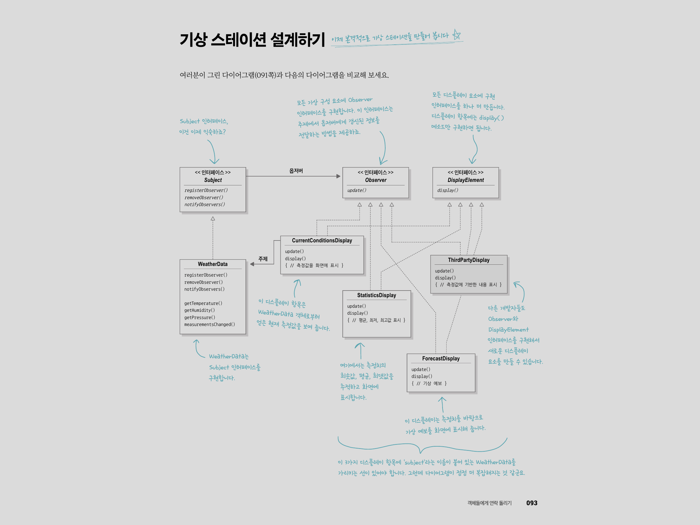

# 옵저버 패턴

### 발행자 - 구독자 관계

* 한 객체의 상태가 바뀌면 그 객체에 의존하는 다른 객체에게 연락이 가고 자동으로 내용이 갱신되는 방식으로 일대다(one-to-many) 의존성을 정의함

* 주제(subject) 인터페이스, 옵저버(observer) 인터페이스가 들어있는 클래스 디자인으로 구현

* 주제가 상태를 저장하고 제어하므로 상태가 들어있는 주제 객체는 하나만 있을 수 있음

* 옵저버는 상태를 사용하지만 소유할 필요는 없음

### 느슨한 결합

* 객체들이 상호작용할 수 있지만 서로 잘 모르는 관계

* 상호작용하는 객체 사이에는 가능하면 느슨한 결합을 사용해야 힘

### WeatherData 객체를 바탕으로 한 기상 스테이션 구축 예제

1. 기상스테이션 (온도, 습도, 기압 정보수집 물리장비)
2. WeatherData (정보 추적)
3. 디스플레이 장비 (현재조건, 기상통계, 기상예보) - 확장성 고려할 것



[ Subject 인터페이스 ]
```
package subject;

import observer.Observer;

public interface Subject {
    public void registerObserver(Observer o);
    public void removeObserver(Observer o);
    public void notifyObservers();
}
```
[ Observer 인터페이스 ]
```
package observer;

public interface Observer {
    public void update();
}
```
[ DisplayElement 인터페이스 ]
```
package observer;

public interface DisplayElement {
    public void display();
}
```
[ Subject 구현한 WeatherData 클래스 ]
```
package subject;

import observer.Observer;
import subject.Subject;

import java.util.ArrayList;
import java.util.List;

public class WeatherData implements Subject {
    private List<Observer> observers;
    private float temperature;
    private float humidity;
    private float pressure;
    public WeatherData(){
        observers = new ArrayList<Observer>();
    }
    @Override
    public void registerObserver(Observer o) {
        observers.add(o);
    }
    @Override
    public void removeObserver(Observer o) {
        observers.remove(o);
    }
    @Override
    public void notifyObservers() {
        observers.forEach(observer -> observer.update());
    }
    public void measurementsChanged(){
        notifyObservers();
    }
    public void setMeasurements(float temperature, float humidity, float pressure){
        this.temperature = temperature;
        this.humidity = humidity;
        this.pressure = pressure;
        measurementsChanged();
    }
    public float getTemperature() {
        return temperature;
    }
    public float getHumidity() {
        return humidity;
    }
    public float getPressure() {
        return pressure;
    }
}
```
[ Observer, DisplayElement 구현한 CurrentConditionDisplay 클래스 ]
```
public class CurrentConditionDisplay implements Observer, DisplayElement {
    private float temperature;
    private float humidity;
    private WeatherData weatherData;
    public CurrentConditionDisplay(WeatherData weatherData){
        this.weatherData = weatherData;
        weatherData.registerObserver(this);
    }
    @Override
    public void display() {
        System.out.println(MessageFormat.format("현재 상태: 온도 {0} F, 습도 {1} %",temperature, humidity));
    }
    @Override
    public void update() {
        this.temperature = weatherData.getTemperature();
        this.humidity = weatherData.getHumidity();
        display();
    }
}
```
[ Weather Station Program ]
```
import observer.CurrentConditionDisplay;
import observer.ForecastDisplay;
import observer.StatisticsDisplay;
import subject.WeatherData;

public class WeatherStation {
    public static void main(String[] args){
        WeatherData weatherData = new WeatherData();

        CurrentConditionDisplay currentConditionDisplay = new CurrentConditionDisplay(weatherData);
        StatisticsDisplay statisticsDisplay = new StatisticsDisplay(weatherData);
        ForecastDisplay forecastDisplay = new ForecastDisplay(weatherData);

        System.out.println("==Welcome to Weather Station==");
        weatherData.setMeasurements(80, 65, 30.4f);
        System.out.println("==============");
        weatherData.setMeasurements(82, 70, 29.2f);
        System.out.println("==============");
        weatherData.setMeasurements(78, 90, 29.2f);
    }
}

<<Result>>

==Welcome to Weather Station==
현재 상태: 온도 80 F, 습도 65 %
평균/최고/최저 온도 = 80/81/79
기상 예보: 쌀쌀하며 비가 올 것 같다
==============
현재 상태: 온도 82 F, 습도 70 %
평균/최고/최저 온도 = 82/83/81
기상 예보: 날씨가 좋아지고 있다
==============
현재 상태: 온도 78 F, 습도 90 %
평균/최고/최저 온도 = 78/79/77
기상 예보: 쌀쌀하며 비가 올 것 같다
```
