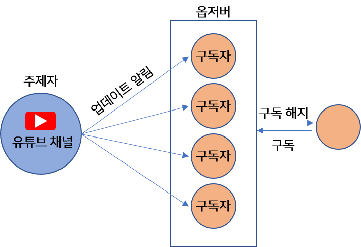
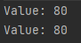

## 옵저버 패턴 이해하기
- 옵저버패턴 = `subject`(주제 (ex.신문사)) + `observer`(옵저버 (ex.구독자))
  - `subject`에서 중요한 데이터를 관리
  - `subject`데이터가 바뀌면 `observer`에게 소식 전달
  - `observer`는 `subject`객체에 등록되어 있음

- 예시 
  
  - 유튜브 채널은 상태를 저장
  - 유튜브 채널은 영상(상태)이 업데이트 되면 구독자에게 알림
  - 구독자는 구독 해지 요청을 통해 `observer`집합에서 제거 가능

> 💡 **옵저버 패턴(Observer Pattern) 정의**
> - **한 객체의 상태가 바뀌면** 그 객체에 의존하는 다른 객체에게 연락이 가고 </br>
> **자동으로 내용이 갱신**되는 방식
> - **일대다(one-to-many)의존성**을 정의
> - 관찰자 패턴이라고도 함
> > **일대다 관계** (하나의 `subject`와 여러 개의 `observer`가 연관!) </br>
> > - `subject`가 상태를 저장하고 제어
> > → 상태가 들어 있는 객체는 하나
> > - `observer`는 상태를 사용만 한다(소유x)
> > - `subject`가 상태 업데이트를 알림 → `observer`는 `subject`에 의존적
> 
> > vs **Publish-Subscribe(출판-구독)패턴**</br>
> > - Publish-Subscribe 패턴은 observer 패턴보다 조금 더 복잡
> > - `subscriber`가 다양한 타입의 메세지에 관심을 설정가능
> > - `subscriber`와 `publisher`를 더 세세한 분리 가능
> > 
> 
> > **느슨한결합(Loose Coupling)**</br>
> > : 객체들이 상호작용할 수는 있지만, 서로를 잘 모르는 관계</br>
> > : 구성 요소가 서로 약하게 연관→ 구성요소의 변화가 서로에게 적은 영향을 미침
> > - 옵저버 패턴은 느슨한 결합인가?
> >   - `subject`는 옵저버가 Observer 인터페이스를 구현한다는 사실만 안다
> >   - `observer`는 언제는 추가 가능
> >   - 새로운 형식의 `observer` 추가에도 `subject`는 변경 필요 없음
> >   - 서로 독립적인 재사용 가능
> >   - 서로의 변화는 서로에게 영향을 미치지 않음
> > >**결합도** </br>: 하나의 클래스가 다른 클래스와 얼마나 많이 연결되어 있는지를 나타내는 표현

### 구현
보통은 `subject`인터페이스와 `observer`인터페이스로 구현
  - `subject`인터페이스
    - `observer` 등록/탈퇴, 업데이트 알림
    ```java
    package headfirst.designpatterns.observer.simple;
        
    public interface Subject {
        public void registerObserver(Observer o);
        public void removeObserver(Observer o);
        public void notifyObservers();
    }
    ```
  
  - `observer`인터페이스
    - 옵저버가 될 가능성이 있는 객체는 반드시 Observer 인터페이스 구현
    - `update()` : `subject`의 상태가 바뀌었을 때 메소드 
    ```java
    package headfirst.designpatterns.observer.simple;

    public interface Observer {
        public void update(int value);
    }

    ```
    
  - subject 구현 클래스
    - setter/getter 메소드가 들어있을 수도 있음
    ```java
    package headfirst.designpatterns.observer.simple;
    
    import java.util.*;
    
    public class SimpleSubject implements Subject {
    private List<Observer> observers;
    private int value = 0;
    
          public SimpleSubject() {
              observers = new ArrayList<Observer>();
          }
    
          public void registerObserver(Observer o) {
              observers.add(o);
          }
    
          public void removeObserver(Observer o) {
              observers.remove(o);
          }
          
          //여기선 push방식을 사용했다.
          //push방식 : 주제가 옵저버에게 상태를 알리는 방식
          public void notifyObservers() {
              for (Observer observer : observers) {
                  observer.update(value);
              }
          }
    
          public void setValue(int value) {
              this.value = value;
              notifyObservers();
          }
    }
    ```
  - observer 구현 클래스
    ```java
    package headfirst.designpatterns.observer.simple;
        
    public class SimpleObserver implements Observer {
        private int value;
        private Subject simpleSubject;
        
        public SimpleObserver(Subject simpleSubject) {
            this.simpleSubject = simpleSubject;
            simpleSubject.registerObserver(this);
        }
        
        public void update(int value) {
            this.value = value;
            display();
        }
        
        public void display() {
            System.out.println("Value: " + value);
        }
    }
    
    ```
    
  - 실행
    ```java
    package headfirst.designpatterns.observer.simple;
    
    public class Example {
    
        public static void main(String[] args) {
            SimpleSubject simpleSubject = new SimpleSubject();
        
            SimpleObserver simpleObserver = new SimpleObserver(simpleSubject);
    
            SimpleObserver simpleObserver2 = new SimpleObserver(simpleSubject);
            
            simpleSubject.setValue(80);
            
            simpleSubject.removeObserver(simpleObserver);
        }
    }
    
    ```
  - 결과</br>
    

### 풀 방식으로 바꾸기 (105p)
> - push : `subject`가 `observer`에게 상태를 알리는 방식
> - pull : `observer`가 `subject`로 부터 상태를 끌어오는 방식

- push 를 사용할 때 하나의 데이터만 갱신해도 되는 상황에서도
  update()메소드에 모든 데이터를 보내도록 되어있다.
  ```java
    public void notifyObservers() {
      for (Observer observer : observers) {
        observer.update(temperature, humidity, pressure);
      }
    }// 95p
  ```
- full방식으로 바꿔 봅시다!
    - 주제에서 알림 보내기
      ```java
        public void notifyObservers() {
          for (Observer observer : observers) {
            observer.update();//옵저버의 update를 인자없이 호출
          }
        }// 105p
      ```
    - 옵저버에서 알림 받기<br/>
      (옵저버의 update()를 고쳐줍니다!)
      ```java
        public interface Observer {
          public void update(); //매개변수 없도록 서명 바꿈
        }// 105p
      ```
      ```java
        public void update() {
          // subject의 게터 메소드로 각자 필요한 데이터들을 가져오도록 
          // Observer구상클리스를 수정합니다.
          this.temperature = weatherData.getTemperature();
          this.humidity = weatherData.getHumidity();
          display();
        }// 105p
      ```

### 정리
- `Observer Pattern`은 **하나의 subject와 여러개의 observer로 구성**되어 있으며,</br>
  이벤트 발생시에 **subject가 동일한 interface(Observer)를 사용해 다수의 observer에게 알림을 보내**는 형식입니다.
  </br>(알려주면 업데이트한다!)
- 상호작용 하는 객체 사이에서는 가능하면 **느슨한 결합**을 사용해야 합니다.
- 디자인원칙
    - **애플리케이션에서 달라지는 부분과 달라지지 않는 부분 분리**
        - 변하는 것: subject 상태, observer 개수와 형식
        - subject를 바꾸지 않고도 observer 변경가능
    - **구현보다는 인터페이스에 맞춰서 프로그래밍**
        - subject interface , observer interface를 사용 → 느슨한 결합
    - **상속보다는 구성을 활용**
        - subject와 observer사이는 구성관계</br>
          (subject에는 0개 이상의 observer가 있다)

