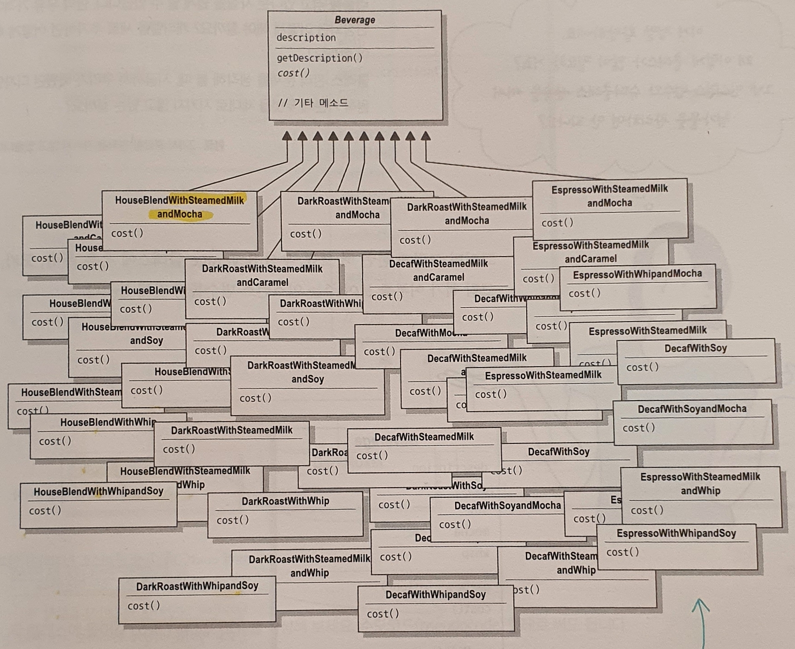
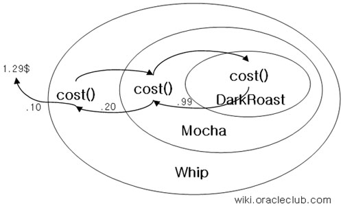
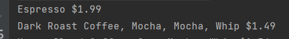
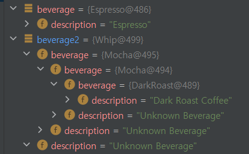

# 데코레이터 패턴 : 객체 꾸미기
실행 중에 클래스를 데코레이션(확장)하는 방법을 배워봅시다!

### ❓ 확장을 상속으로 한다면? (114p)
#### ex. 음료를 주문해 봅시다!
- Beverage 추장 클래스
     ```java
    package decorator.starbuzz;
    
    public abstract class Beverage {
        String description = "Unknown Beverage";
    
        public String getDescription() {
            return description;
        }
     
        public abstract double cost();
    }
    ```
- Beverage 구현클래스 - 모든 음료는 Beverage 추상 클래스의 서브 클래스가 됩니다.
  
  → 클래스가 너무 많아집니다!
#### 조금 바꿔봅시다!
- Beverage 슈퍼클래스
  ```java
    public class Beverage{
        public double cost(){
            double condimentCost = 0.0;
            if(hasMilk()){
                condimentCost += milkCost;
            }
            if(hasSoy()){
                condimentCost += soyCost;
            }
            if(hasMocha()){
                condimentCost += mochaCost;
            }   
            if(hasWhip()){
                condimentCost += whipCost;
            }
        } 
    }
  ```
- DarkRoast
  ```java
    public class DarkRoast extends Beverage {
        public DarkRoast(){
            description = "다크로스트 커피";
        }
  
        public double cost(){
            return 1.99 + super.cost();
        }     
    } 
  ```
- 문제점
  - 첨가물 종류가 많아지면? cost(), 새로운 메소드 추가(ex. getter/setter)
  - 가격이 바뀌면? 기존 코드 수정
  - 특정 첨가물이 들어가면 안되는 음료는? 쓸모없는 코드를 상속받게 됨.
  - 동일한 첨가물을 두번 넣으려면? 현재 첨가물 인스턴스 변수 타입은 boolean
  
  <br>*이러한 문제점은 기존 코드를 고쳐야하는 문제가 발생하게 됩니다.
  <br>기존 코드를 고치는 대신 새로운 코드를 만들어서 기능을 추가하도록 하는 것이 좋습니다.*
  
  > ### 💡 **OCP(Open-Closed Principle)**<br>
  > : 클래스 확장에는 열려 있어야 하지만 변경에는 닫혀 있어야 한다.


## 데코레이터 패턴 이해하기 (122p)
- `구성요소`와 `데코레이터`
</br>
  - `구성요소` : 장식당하는 애
    - 추상 구성 요소(Beverage)와 구상 구성 요소(HouseBlend)
  - `데코레이터` : 장식하는 애
    - 추상 데코레이터(CondimentDecorator)와 구상 데코레이터(Mocha)
    - 데코레이터의 슈퍼클래스는 자신이 장식하고 있는 객체의 슈퍼클래스와 같습니다.
    - 데코레이터는 **자신이 장식하고 있는 객체에게 어떤 행동을 위임하는 일 말고도 추가 작업을  수행할 수 있습니다.**
      > **ex) 모카 다크로스트** 
      > 1. 모카의 cost()호출
      > 2. 모카는 다크로스트에게 가격 계산 위임
      > 3. 모카는 다크로스트에게 받은 가격에 모카가격 추가
      > 4. 모카 다크로스트 가격 계산 완료
        
- 한 객체를 여러 개의 데코레이터로 감쌀 수 있습니다.
- 구성 요소 객체가 들어갈 자리에 데코레이터 객체를 넣어도 상관없습니다.</br>
  (→ 간단히 말해서 데코를 한 데코레이터를 데코할 수 있다.)
- 실행 중 언제든 필요한 데코레이터 적용 가능

> ### 💡 데코레이터 패턴(Decorator Pattern) (125p)
> : 객체에 추가 요소를 동적으로 더할 수 있다.
> <br>데코레이터를 사용하면 서브클래스를 만들 때보다 훨씬 유연하게 기능을 확장할 수 있다.
> > ❓ 왜 인터페이스가 아닌 추상클래스로 되어있을까?<br>
> > : 사실 인터페이스로 하면되는데 받은 코드가 원래 추상클래스여서.. <br>기존 코드를 고치는 일을 피하고자 그랬다고 합니다!


### Starbuzz
- `구성요소` : 장식당하는 애
  - 추상 구성 요소(Beverage)
    ```java
    public abstract class Beverage {
        String description = "Unknown Beverage";
    
        public String getDescription() {
            return description;
        }
   
        public abstract double cost();
    }
    ```
  - 구상 구성 요소(DarkRoast)
    ```java
    public class DarkRoast extends Beverage {
        public DarkRoast() {
            description = "Dark Roast Coffee";
        }
  
        public double cost() {
            return .99;
        }
    }
    ```
- `데코레이터` : 장식하는 애
  - 추상 데코레이터(CondimentDecorator)
    ```java
    public abstract class CondimentDecorator extends Beverage {
        Beverage beverage;
        public abstract String getDescription();
    }
    ```
  - 구상 데코레이터(Mocha)
    ```java
    public class Mocha extends CondimentDecorator {
        public Mocha(Beverage beverage) {
            this.beverage = beverage;
        }
   
        public String getDescription() {
            return beverage.getDescription() + ", Mocha";
        }
   
        public double cost() {
            return .20 + beverage.cost();
        }
    }
    ```
- 실행
  ```java
  public class StarbuzzCoffee {
   
      public static void main(String args[]) {
          Beverage beverage = new Espresso();
          System.out.println(beverage.getDescription() 
                + " $" + beverage.cost());
          Beverage beverage2 = new DarkRoast();
          beverage2 = new Mocha(beverage2);
          beverage2 = new Mocha(beverage2);
          beverage2 = new Whip(beverage2);
          System.out.println(beverage2.getDescription() 
                  + " $" + beverage2.cost());
      }
  }
  ```
- 결과<br>
  <br>
  

### 정리
- 상속 대신 데코레이터 패턴으로 확장을 하자
- OCP