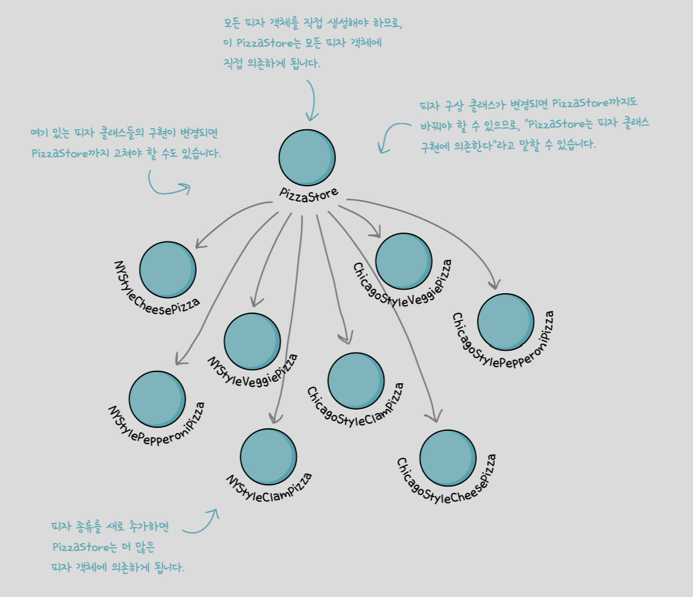
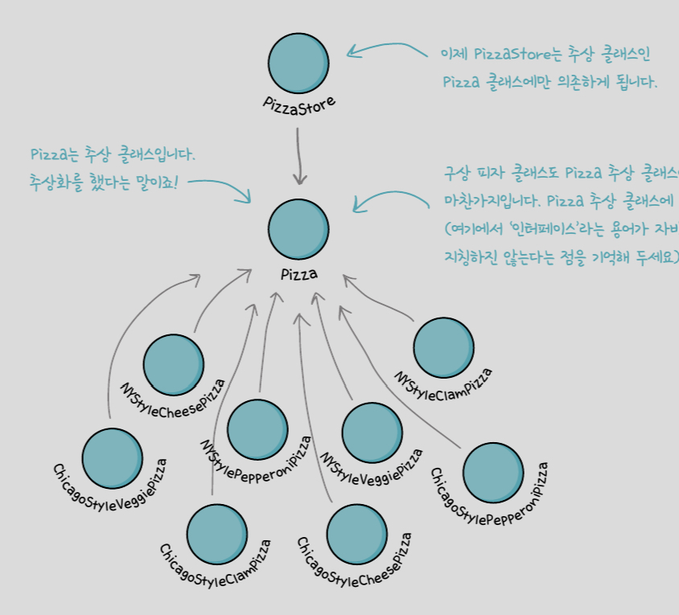

# 4장 팩토리 패턴 (Factory Pattern)
팩토리는 객체 생성을 처리(캡슐화)하는 클래스를 말하며, 팩토리 패턴은 애플리케이션의 구상 클래스 의존성을 줄이고 추상화를 지향함으로써 느슨한 결합을 도와준다.

<br>

- [간단한 팩토리](#01-간단한-팩토리)

- [팩토리 메소드 패턴](#02-1-팩토리-메소드-패턴)

- [추상 팩토리 패턴](#03-추상-팩토리-패턴)

<br>

> 피자 가게를 운영해 봅시다! 

<br>

## 01. 간단한 팩토리

<br>

```java
Pizza orderPizza(String type){
    Pizza pizza;

    //바뀌는 부분 -> 캡슐화
    if(type.equals("cheese")){
        pizza = new CheesePizza();
    } else if {
        ...
    } ...

    //바뀌지 않는 부분
    pizza.prepare();
    pizza.bake();
    ...

    return pizza;
}
```
간단한 팩토리를 이용하여 클라이언트와 구상 클래스를 분리하여 불필요한 의존성을 없애고 결합 문제를 해결하자.

<br>

<객체 생성 전담 클래스>

```java
public class SimpleFactory{
    public Pizza createPizza(String type){
        Pizza pizza;
        if(type.equals("cheese")){
            pizza = new CheesePizza();
        } else if {
          ...
        } ...
        return pizza;
    }
}
```
<팩토리를 사용하는 클라이언트>
```java
public class PizzaStore{
    SimpleFactory factory;
    public PizzaStore(SimpleFactory factory){
        this.factory = factory;
    }
    public Pizza orderPizza(String type){
        pizza.prepare();
        pizza.bake();
        ...
        return pizza;
    }
}
```
피자 가게를 운영해 보니,
```java
NYPizzaFactory nyFactory = new NYPizzaFactory();
PizzaStore nyStore = new PizzaStore(nyFactory);
nyStore.orderPizza('cheese');
```
각 지점마다 피자를 굽고 자르고 준비하는 방식이 달라, 유연성을 잃지 않으면서도 PizzaStore와 피자 제작 코드 전체를 하나로 묶어줄 필요성이 생김.

<br>

## 02-1. 팩토리 메소드 패턴

<br>

- 클래스를 확장(상속)하고 팩토리 메소드를 오버라이드하여 객체를 생성한다.

- 서브 클래스에서 어떤 클래스를 만들지 결정함으로써 객체 생성을 캡슐화한다. 

- 팩토리 메소드 패턴에서는 객체를 생성할 때 필요한 인터페이스를 만드는데 어떤 클래스의 인스턴스를 만들지는 서브클래스에서 결정한다.

- 간단한 팩토리는 객체 생성을 캡슐화하지만 생성하는 제품을 마음대로 변경할 수 없어 유연성이 떨어진다.

- 팩토리 메소드를 사용하면 간단한 팩토리와 달리 여러 번 재사용이 가능한 프레임워크를 만들 수 있다.

<br>

<피자가게 클래스>
```java
public abstract class PizzaStore{
    public Pizza orderPizza(String type){
        Pizza pizza;
        //팩토리 객체가 아닌 추상 메소드 호출
        pizza = createPizza(type);

        pizza.prepare();
        pizza.bake();
        ...
        return pizza;
    }
    //팩토리 메소드 선언
    //추상메소드로 선언하여 서브 클래스가 객체생성을 책임지도록 한다
    protected abstract Pizza createPizza(String type);
}
```
<피자가게 구상 서브 클래스>
```java
public class NYPizzaStore extends PizzaStore{
    Pizza createPizza(String item){
        if(item.equals("cheese")){
            return new NYCheesePizza();
        } else if {
          ...
        } else return null;
    }
}
```

<피자 클래스>
```java
public abstract class Pizza{
    String name; String dough; ...
    void prepare(){}
    void bake(){{}}
    ...
}
```

<피자 구상 서브 클래스>
```java
public class NYCheesePizza extends Pizza{
    public NYCheesePizza(){name =""; dough=""}
}
```

피자 가게를 운영해 보니,
```java
PizzaStore nyStore = new NYPizzaStore();
nyStore.orderPizza('cheese');
Pizza pizza = createPizza('cheese');
pizza.prepare();
```
피자를 만드는 과정은 통일이 되었는데, 원재료 관리가 제각각.

지점별로 원재료군(family)을 처리할 방법이 필요. 

[원재료 팩토리 만들기 Go!](#03-추상-팩토리-패턴)

<br>

## 02-2. 의존성 뒤집기(Dependency Inversion Principle)

<br>

> 추상화된 것에 의존하게 만들고 구상 클래스에 의존하지 않게 만든다는 디자인 원칙

<br>

### 의존성 뒤집기 원칙 지키는 방법

<br>

- 변수에 구상 클래스의 레퍼런스 저장하지 않기

    new 연산자를 사용하면 구상 클래스의 레퍼런스를 사용하게 된다. 팩토리를 써서 구상 클래스의 레퍼런스를 변수에 저장하는 일을 미리 방지하자.

- 구상 클래스에서 유도된 클래스 만들지 않기

    특정 구상 클래스에 의존하는 것을 방지

- 베이스 클래스에 이미 구현되어 있는 메소드를 오버라이드 하지 않기

    제대로된 추상화를 하려면 베이스 클래스에서 메소드를 정의할 때 모든 서브 클래스에서 공유할 수 있는 것만 정의해야 한다.

<br>




<br>

## 03. 추상 팩토리 패턴 

<br>

- 객체 구성 활용

- 팩토리 인터페이스에서 선언한 메소드에서 객체 생성 구현

- 구상 클래스에 직접 의존하지 않고 서로 관련된 객체로 이루어진 제품군을 생산하는 용도로 쓰인다

<br>

<원재료 팩토리>
```java
public interface PizzaIngredientFactory{
    public Dough createDough();
    public Sauce createSauce();
    ...
}
```

<원재료 팩토리 구현>
```java
public class NYPizzaIngredientFactory implements PizzaIngredientFactory{
    public Dough createDouch(){
        return new ThinCrustDough();
    }
    ...
}
```
<피자 클래스>
```java
public abstract class Pizza{
    Dough dough; Sauce sauce; ...
    abstract void prepare(){
    void bake();
    ...
    }
}
```
<피자 클래스 상속한 치즈피자>
```java
public class CheesePizza extends Pizza{
    PizzaIngredientFactory ingFactory;
    //팩토리에서 생산한 원재료만 사용하도록!
    public CheesePizza(PizzaIngredientFactory ingFactory){
        this.ingFactory = ingFactory;
    }
    void prepare(){
        dough = ingFactory.createDough();
    }
}
```
<피자가게 클래스>
```java
public class NYPizzaStore extends PizzaStore{
    Pizza createPizza(String item){
        Pizza pizza;

        PizzaIngredientFactory nyIngFactory = new NYPizzaIngredientFactory();
        
        if(item.equals("cheese")){
            return new NYCheesePizza(nyIngFactory);
        } else if {
          ...
        }
        return pizza;
    }
}
```

피자 가게 운영
```java
PizzaStore nyStore = new NYPizzaStore();
nyStore.orderPizza('cheese');
Pizza pizza = createPizza('cheese');
    Pizza pizza = new CheesePizza(nyIngFactory);
pizza.prepare();
```