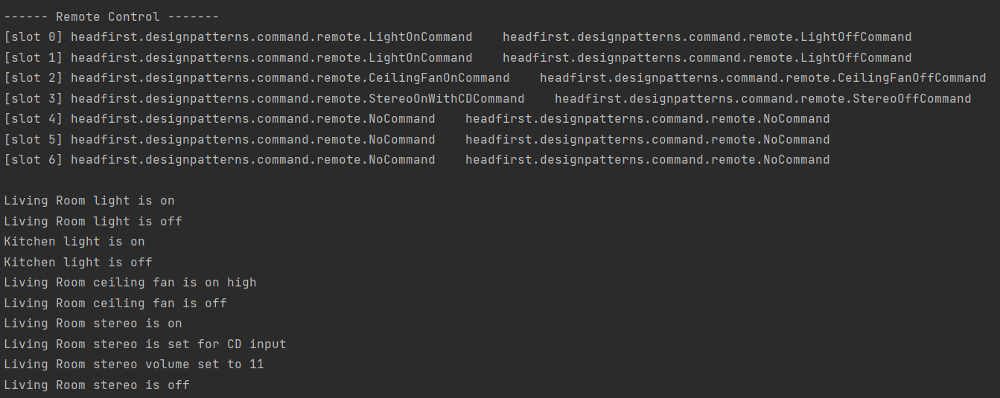
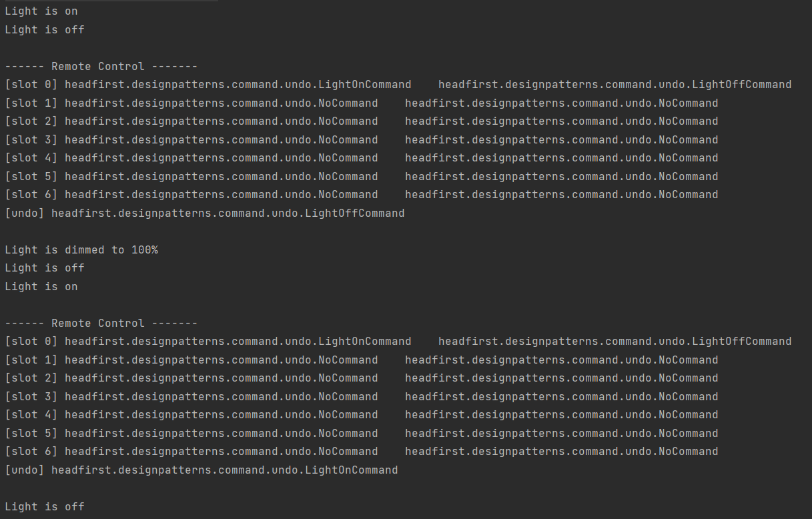

# 커맨드 패턴(Command Pattern)
: 요청 내역을 객체로 캡슐화해서 객체를 서로 다른 요청 내역에 따라 매개변수화할 수 있다.
## 커맨드 패턴 이해하기
- 커맨트 패턴을 사용함으로써 작업을 **요청**하는 쪽과 작업을 **처리**하는 쪽을 분리해보자
    - 작업을 요청하는 인보커와 작업을 처리하는 리시버
- 리시버
  ```java
  public class Light {
      String location = "";
  
      public Light(String location) {
          this.location = location;
      }
  
      public void on() {
          System.out.println(location + " light is on");
      }
  
      public void off() {
          System.out.println(location + " light is off");
      }
  }
  ```
- Command 인터페이스
    ```java     
    public interface Command {
        public void execute();
    }
    ```
- Command 구현 클래스 (ex.LightOnCommand, LightOffCommand...)
  ```java
  public class LightOnCommand implements Command {
      Light light; 
    
      public LightOnCommand(Light light) {
          this.light = light;
      }
   
      public void execute() {
          light.on();
      }
  }
  ```
    - **리시버객체**(Lignt)가 들어있다.
        - 정확히 어떤 객체인지 알 수 있도록 인스턴스 변수에 정보 저장
    - 일련의 행동(on)을 특정 리시버(light)와 연결함으로써 요청을 캡슐화!!
        - 행동과 리시버를 한 객체에 넣고, excute()라는 메소드만 외부에 공개
    - excute()을 구현
- invoker(리모컨)
  ```java
  package headfirst.designpatterns.command.remote;
  
  public class RemoteControl {
      Command[] onCommands;
      Command[] offCommands;
   
      public RemoteControl() {
          //초기화! * Null 객체 *
          onCommands = new Command[7];
          offCommands = new Command[7];
   
          Command noCommand = new NoCommand();
          for (int i = 0; i < 7; i++) {
              onCommands[i] = noCommand;
              offCommands[i] = noCommand;
          }
      }
    
      public void setCommand(int slot, Command onCommand, Command offCommand) {
          //on off 버튼 설정
          onCommands[slot] = onCommand;
          offCommands[slot] = offCommand;
      }
   
      public void onButtonWasPushed(int slot) {
          onCommands[slot].execute();
      }
   
      public void offButtonWasPushed(int slot) {
          offCommands[slot].execute();
      }
    
      public String toString() { 
          // invoker 정보 프린트
          StringBuffer stringBuff = new StringBuffer();
          stringBuff.append("\n------ Remote Control -------\n");
          for (int i = 0; i < onCommands.length; i++) {
              stringBuff.append("[slot " + i + "] " + onCommands[i].getClass().getName()
                  + "    " + offCommands[i].getClass().getName() + "\n");
          }
          return stringBuff.toString();
      }
  }
  ```
    - 버튼 누르는 메소드를 호출(요청)함으로써 해당 커맨드 객체의 excute() 메소드가 호출
  > **NullCommand 객체**
  > - 일종의 Null객체
      >   - Null 객체 : 딱히 리턴할 객체도 없고 클라이언트가 null을 처리하지 않게 하고 싶을 때 활용하면 좋다.
  > ```java
  > public void onButtonWasPushed(int slot){
  >     if(onCommands[slot] != null){ // Null객체를 사용하면 필요없음
  >         onCommands[slot].execute();    
  >     }
  > }
  > ``` 
  > - 여러 디자인 패턴에서 유용하게 사용됨.
- Test
  ```java
  package headfirst.designpatterns.command.remote;
  
  public class RemoteLoader {
   
      public static void main(String[] args) {
          //인보커 생성
          RemoteControl remoteControl = new RemoteControl();
          
          //리시버 생성
          Light livingRoomLight = new Light("Living Room");
          Light kitchenLight = new Light("Kitchen");
          CeilingFan ceilingFan= new CeilingFan("Living Room");
          GarageDoor garageDoor = new GarageDoor("Garage");
          Stereo stereo = new Stereo("Living Room");
    
          //커맨드 생성
          LightOnCommand livingRoomLightOn = 
                  new LightOnCommand(livingRoomLight);
          LightOffCommand livingRoomLightOff = 
                  new LightOffCommand(livingRoomLight);
          LightOnCommand kitchenLightOn = 
                  new LightOnCommand(kitchenLight);
          LightOffCommand kitchenLightOff = 
                  new LightOffCommand(kitchenLight);
    
          CeilingFanOnCommand ceilingFanOn = 
                  new CeilingFanOnCommand(ceilingFan);
          CeilingFanOffCommand ceilingFanOff = 
                  new CeilingFanOffCommand(ceilingFan);
   
          GarageDoorUpCommand garageDoorUp =
                  new GarageDoorUpCommand(garageDoor);
          GarageDoorDownCommand garageDoorDown =
                  new GarageDoorDownCommand(garageDoor);
   
          StereoOnWithCDCommand stereoOnWithCD =
                  new StereoOnWithCDCommand(stereo);
          StereoOffCommand  stereoOff =
                  new StereoOffCommand(stereo);
          
          //인보커에 커맨드 세팅
          remoteControl.setCommand(0, livingRoomLightOn, livingRoomLightOff);
          remoteControl.setCommand(1, kitchenLightOn, kitchenLightOff);
          remoteControl.setCommand(2, ceilingFanOn, ceilingFanOff);
          remoteControl.setCommand(3, stereoOnWithCD, stereoOff);
    
          //인보커 상태 정보 프린트
          System.out.println(remoteControl);
   
          //클라이언트가 인보커로 명령요청!!!
          // 이코드에서 볼 수 있듯 인보커는 요청을 할 뿐 어떻게 작동하는지는 모른다.
          remoteControl.onButtonWasPushed(0);
          remoteControl.offButtonWasPushed(0);
          remoteControl.onButtonWasPushed(1);
          remoteControl.offButtonWasPushed(1);
          remoteControl.onButtonWasPushed(2);
          remoteControl.offButtonWasPushed(2);
          remoteControl.onButtonWasPushed(3);
          remoteControl.offButtonWasPushed(3);
      }
  }
  ```
  
    - 해당 코드에서 볼 수 있듯 인보커는 작동 방법을 몰라도 해당 리시버에 요청을 할 수 있습니다!!!

### 작업 취소 기능 추가
- excute() 메소드에서 했던 작업과 정반대의 작업을 처리하면 됩니다!!
- 리시버
  ```java
  public class Light {
      String location;
      int level;
  
      public Light(String location) {
          this.location = location;
      }
  
      public void on() {
          level = 100;
          System.out.println("Light is on");
      }
  
      public void off() {
          level = 0;
          System.out.println("Light is off");
      }
  
      public void dim(int level) {
          this.level = level;
          if (level == 0) {
              off();
          }
          else {
              System.out.println("Light is dimmed to " + level + "%");
          }
      }
  
      public int getLevel() {
          return level;
      }
  }
  ```
- Command 인터페이스
  ```java
  public interface Command {
      public void execute();
      public void undo();
  }
  ```
    - undo() 추가
- Command 구현 클래스
  ```java
  public class LightOnCommand implements Command {
      Light light;
      int level;
      public LightOnCommand(Light light) {
          this.light = light;
      }
   
      public void execute() {
          level = light.getLevel();
          light.on();
      }
   
      public void undo() {
          light.dim(level);
      }
  }
  ```
- Invoker
  ```java
  public class RemoteControlWithUndo {
      Command[] onCommands;
      Command[] offCommands;
      Command undoCommand; //추가
   
      public RemoteControlWithUndo() {
          onCommands = new Command[7];
          offCommands = new Command[7];
   
          Command noCommand = new NoCommand();
          for(int i=0;i<7;i++) {
              onCommands[i] = noCommand;
              offCommands[i] = noCommand;
          }
          undoCommand = noCommand; // 추가
      }
    
      public void setCommand(int slot, Command onCommand, Command offCommand) {
          onCommands[slot] = onCommand;
          offCommands[slot] = offCommand;
      }
   
      public void onButtonWasPushed(int slot) {
          onCommands[slot].execute();
          undoCommand = onCommands[slot];// 추가
      }
   
      public void offButtonWasPushed(int slot) {
          offCommands[slot].execute();
          undoCommand = offCommands[slot]; // 추가
      }
   
      public void undoButtonWasPushed() { // 추가 : 마지막으로 했던 작업 취소
          undoCommand.undo();
      }
    
      public String toString() {
          StringBuffer stringBuff = new StringBuffer();
          stringBuff.append("\n------ Remote Control -------\n");
          for (int i = 0; i < onCommands.length; i++) {
              stringBuff.append("[slot " + i + "] " + onCommands[i].getClass().getName()
                  + "    " + offCommands[i].getClass().getName() + "\n");
          }
          stringBuff.append("[undo] " + undoCommand.getClass().getName() + "\n");
          return stringBuff.toString();
      }
  }
  ```
- Test
  ```java
  package headfirst.designpatterns.command.undo;
  
  public class RemoteLoader {
   
      public static void main(String[] args) {
          RemoteControlWithUndo remoteControl = new RemoteControlWithUndo();
   
          Light livingRoomLight = new Light("Living Room");
   
          LightOnCommand livingRoomLightOn = 
                  new LightOnCommand(livingRoomLight);
          LightOffCommand livingRoomLightOff = 
                  new LightOffCommand(livingRoomLight);
   
          remoteControl.setCommand(0, livingRoomLightOn, livingRoomLightOff);
   
          remoteControl.onButtonWasPushed(0);
          remoteControl.offButtonWasPushed(0);
          System.out.println(remoteControl);
          remoteControl.undoButtonWasPushed();
          remoteControl.offButtonWasPushed(0);
          remoteControl.onButtonWasPushed(0);
          System.out.println(remoteControl);
          remoteControl.undoButtonWasPushed();
      }
  }
  ```
  
  
### 여러 동작을 한 번에 처리
- MacroCommand : 다른 커맨드를 실행할 수 있는 커맨드  
  ```java
  public class MacroCommand implements Command {
      Command[] commands;
   
      public MacroCommand(Command[] commands) {
          this.commands = commands;
      }
   
      public void execute() {
          for (int i = 0; i < commands.length; i++) {
              commands[i].execute();
          }
      }
   
      /**
       * NOTE:  these commands have to be done backwards to ensure 
       * proper undo functionality
       */
      public void undo() {
          for (int i = commands.length -1; i >= 0; i--) {
              commands[i].undo();
          }
      }
  }
  ```
  
