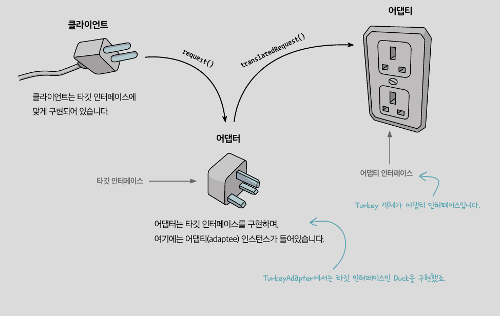
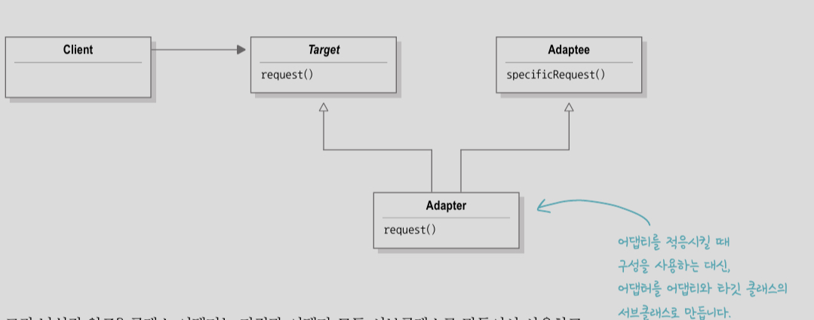
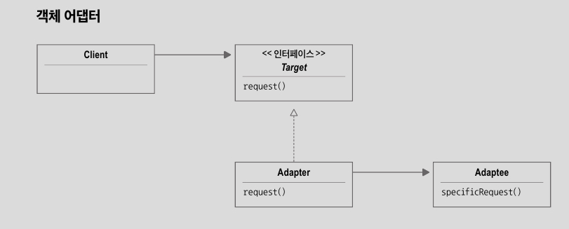
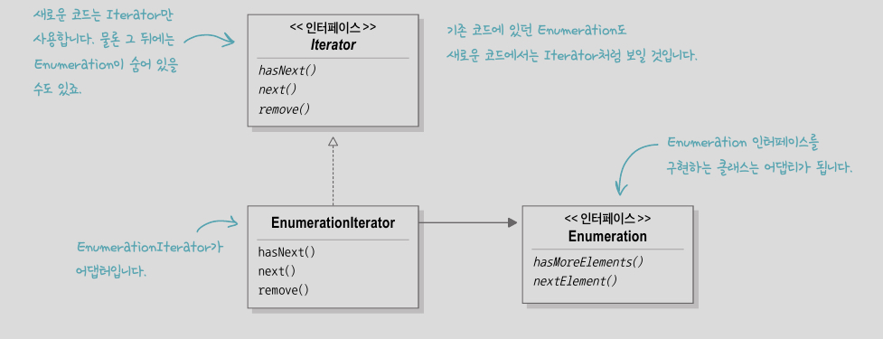
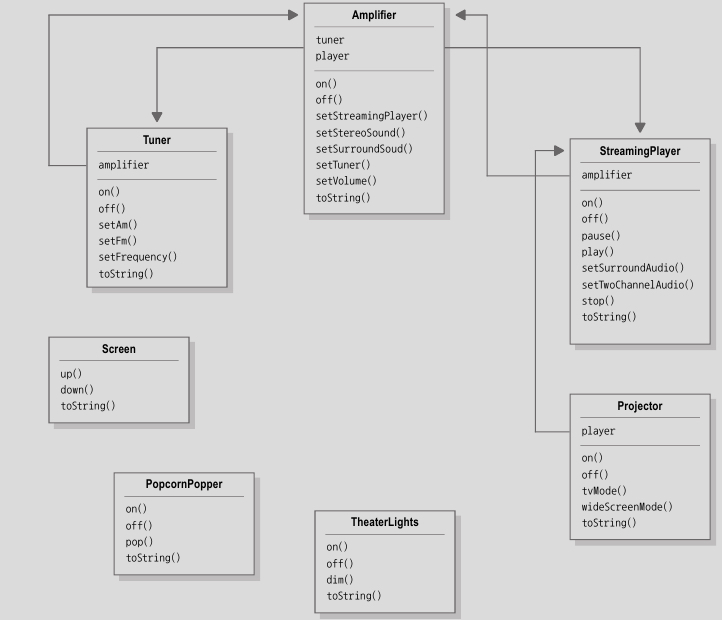
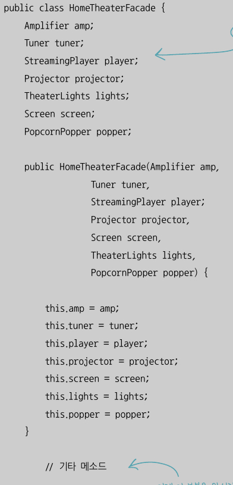
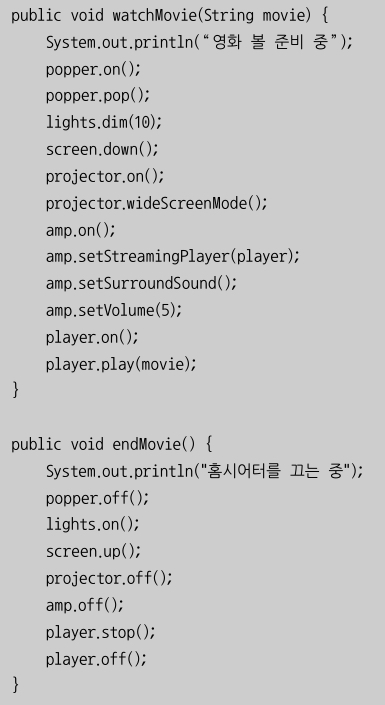
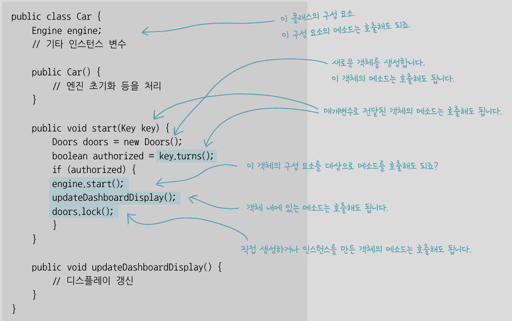

# 어댑터 패턴

어댑터 패턴은 특정 클래스 인터페이스를 클라이언트에서 요구하는 다른 인터페이스로 변환하는 용도로 쓰인다. 인터페이스가 호환되지 않아 같이 쓸 수 없었던 클래를 사용할 수 있게 도와준다.



<br>

## 1. 클래스 어댑터 (클래스 상속)

클래스 어댑터 패턴을 쓰려면 다중 상속이 필요한데 자바에서는 다중 상속이 불가능하다.



<br>

## 2. 객체 어댑터 (객체 구성)



<br>

- 초기 컬렉션 형식(Vector, Stack, Hashtable)에는 Enumeration을 리턴하는 hasMoreElements(), nextElement() 메소드가 구현되어 있어 Enumeration 인터페이스를 사용하면 컬렉션의 모든 항목에 접근할 수 있었다.

- 그 후, Iterator 인터페이스를 쓰기 시작했고 새로운 코드를 만들 때는 Iterator만 사용하는 것이 좋다.
Iterator 인터페이스는 hasNext(), next(), remove() 메소드를 가진다.

<br>



<br>

- remove() 메소드를 처리하는 EnumerationIterator 어댑터 코드를 만들어 Enumeration을 Iterator에 적응시키자

```java
public class EnumerationIterator implements Iterator<Object> {
    Enumeration<?> enumeration;

    public EnumerationIterator(Enumeration<?> enumeration) {
        this.enumeration = enumeration;
    }
    public boolean hasNext() {
        return enumeration.hasMoreElements();
    }
    public Object next() {
        return enumeration.nextElement();
    }
    public void remove() {
        throw new UnsupportedOperationException();
    }
}
```

<br>

# 퍼사드 패턴

인터페이스를 간단하게 변경하기 위한 패턴.

퍼사드 패턴과 어댑터 패턴의 차이점은 퍼사드는 인터페이스를 단순하게 만드는 용도로, 어댑터는 인터페이스를 다른 인터페이스로 변환하는 용도로 쓰인다는 것이다.

<br>

- 영화 보기



<br>

```java
popper.on();
popper.pop();

lights.dim(10);

screen.down();

projector.on();
projector.setInput(player);
projector.wideScreenMode();

amp.on();
amp.setDvd(player);
amp.setSurroundSound();
amp.setVolume(5);

player.on();
player.play(music);
```

<br>

서브시스템에 들어가는 모든 구성 요소를 매개변수로 전달해서 퍼사드 인스턴스를 만든다.

<br>

```java
HomeTheaterFacade homeTheater = new HomeTheaterFacade(amp, tuner, player, projector, screen, lights, popper);

homeTheater.watchMovie("인디아나 존스");
homeTheater.endMovie();
```

<br>




<br>

# 최소 지식 원칙 (Principle of Least Knowledge, 데메테르의 법칙)

객체 사이의 상호작용은 되도록이면 아주 가까운 '친구' 사이에서만 허용하는 편이 좋다. 여러 객체와 관계맺기를 지양해야 한다.

- 원칙을 따르지 않은 경우

```java
public float getTemp() {
    Thermometer thermometer = station.getThermometer();
    return thermometer.getTemperature();
}
```

- 원칙을 따르는 경우
```java
public float getTemp() {
    return station.getTemperature();
}
```

- 호출해도 되는 객체는??

    - 객체 자체

    - 메소드에 매개변수로 전달된 객체

    - 메소드를 생성하거나 인스턴스를 만든 객체

    - 객체에 속하는 구성 요소



