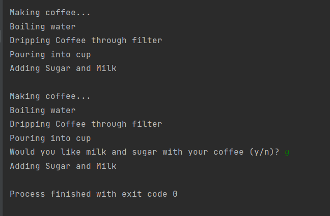

# 템플릿 메소드 패턴

## 템플릿 메소드 패턴! 어떤 상황에 필요할까?

예제로 두 클래스를 보겠습니다.

- coffee 클래스
    
    ```java
    package headfirst.designpatterns.templatemethod.simplebarista;
    
    public class Coffee {
     
    	void prepareRecipe() {
    		boilWater();
    		brewCoffeeGrinds();
    		pourInCup();
    		addSugarAndMilk();
    	}
     
    	public void boilWater() {
    		System.out.println("Boiling water");
    	}
     
    	public void brewCoffeeGrinds() {
    		System.out.println("Dripping Coffee through filter");
    	}
     
    	public void pourInCup() {
    		System.out.println("Pouring into cup");
    	}
     
    	public void addSugarAndMilk() {
    		System.out.println("Adding Sugar and Milk");
    	}
    }
    ```
    
- tea 클래스
    
    ```java
    package headfirst.designpatterns.templatemethod.simplebarista;
    
    public class Tea {
     
    	void prepareRecipe() {
    		boilWater();
    		steepTeaBag();
    		pourInCup();
    		addLemon();
    	}
     
    	public void boilWater() {
    		System.out.println("Boiling water");
    	}
     
    	public void steepTeaBag() {
    		System.out.println("Steeping the tea");
    	}
     
    	public void addLemon() {
    		System.out.println("Adding Lemon");
    	}
     
    	public void pourInCup() {
    		System.out.println("Pouring into cup");
    	}
    }
    ```
    
- 중복: prepareRecipe()와 boilWater() , pourInCup()
- 비슷한 점
    - brewCoffeeGrinds()와 steepTeaBag() - 우려낸다.
    - addSugarAndMilk()와 addLemon() - 첨가물을 추가한다.
- 정리를 해보면 둘의 prepareRecipe()의 알고리즘이 같다는 것을 알 수 있습니다.
    1. 물을 끓인다.
    2. 뜨거운 물을 사용해서 커피 또는 찻잎을 우려낸다.
    3. 음료를 컵에 따른다
    4. 각 음료에 맞는 첨갑물을 추가한다.

그러니 prepareRecipe()를 클래스에서 뽑아서 추상화해보도록 합시다!_!

- CaffeineBeverge 추상 클래스
    
    ```java
    package headfirst.designpatterns.templatemethod.barista;
    
    public abstract class CaffeineBeverage {
      // final 선언 : 서브클래스가 아무렇게나 오버라이드하지 못하도록 방지 
    	final void prepareRecipe() {
    		boilWater();
    		brew();
    		pourInCup();
    		addCondiments();
    	}
     
    	// 추상메서드 : 서브클래스가 서로 다른 방식으로 처리하도록 한다
    	abstract void brew();
      
    	abstract void addCondiments();
     
    	// 공통으로 사용하기 때문에 추상클래스에서 바로 구현!
    	void boilWater() {
    		System.out.println("Boiling water");
    	}
      
    	void pourInCup() {
    		System.out.println("Pouring into cup");
    	}
    }
    ```
    
- CaffeineBeverge 확장하는 서브클래스
    
    추상메서드를 구현합니다!
    
    - Tea 클래스
        
        ```java
        package headfirst.designpatterns.templatemethod.barista;
        
        public class Tea extends CaffeineBeverage {
        	public void brew() {
        		System.out.println("Steeping the tea");
        	}
        	public void addCondiments() {
        		System.out.println("Adding Lemon");
        	}
        }
        ```
        
    - Coffe 클래스
        
        ```java
        package headfirst.designpatterns.templatemethod.barista;
        
        public class Coffee extends CaffeineBeverage {
        	public void brew() {
        		System.out.println("Dripping Coffee through filter");
        	}
        	public void addCondiments() {
        		System.out.println("Adding Sugar and Milk");
        	}
        }
        ```
        
    

## 템플릿 메소드 패턴 알아보기

- 위에서본 CaffeineBeverage 클래스의 prepareRecipe()는 템플릿 메소드 입니다!
    1. prepairRecipte()도 메소드
    2. 어떤 알고리즘의 템플릿 역할을 함.
        
        (여기서는 음료를 만드는 알고리즘)
        
- 템플릿 메소드는 알고리즘의 **각 단계를 순서대로 정의**하며, **각 단계는 메소드로 정의**하고,
서브클래스에서 일부 단계(=메소드)를 구현하도록 유도합니다.
- 장점
    - 알고리즘을 독점
    - 코드 재사용
    - 확장 시 (=음료추가) 몇 가지 메소드만 만들면 됨.
    - 알고리즘이 집중되어 있음
        
        → 알고리즘 변경 시 한 곳만 고치면 됨
        
        → 일부 구현만 서브클래스에 의존
        

## 템플릿 메소드 패턴(Template Method Pattern)

:  알고리즘의 골격을 정의

사용 시 알고리즘의 일부 단계를 서브클래스에서 구현할 수 있으며,
알고리즘의 구조는 그대로 유지하면서 알고리즘의 특정 단계를 서브클래스에서 재정의 가능하다.

알고리즘이 구체적인 구현으로부터 분리될 수 있다!

```java
abstract class Abstract Class - 복붙하고 주석달기 327p
```

## 후크(Hook)

: 추상 클래스에서 선언되지만 기본적인 내용만 구현되어 있거나 아무 코드도 들어있지 않은 메소드

- 서브클래스가 다양한 위치에서 알고리즘에 끼어들 수 있게 해준다!
    
    ```java
    328p
    package headfirst.designpatterns.templatemethod.barista;
    
    public abstract class CaffeineBeverageWithHook {
     
    	final void prepareRecipe() {
    		boilWater();
    		brew();
    		pourInCup();
    		if (customerWantsCondiments()) {
    			addCondiments();
    		}
    	}
     
    	abstract void brew();
     
    	abstract void addCondiments();
     
    	void boilWater() {
    		System.out.println("Boiling water");
    	}
     
    	void pourInCup() {
    		System.out.println("Pouring into cup");
    	}
     
    	boolean customerWantsCondiments() {
    		return true;
    	}
    }
    ```
    
- 후크 활용하기
    - 후크를 활용하기 위해선 오버라이드 필요!
        
        ```java
        //특정 부분을 처리할지 말지를 결정하는 용도인 후크 329
        package headfirst.designpatterns.templatemethod.barista;
        
        import java.io.*;
        
        public class CoffeeWithHook extends CaffeineBeverageWithHook {
         
        	public void brew() {
        		System.out.println("Dripping Coffee through filter");
        	}
         
        	public void addCondiments() {
        		System.out.println("Adding Sugar and Milk");
        	}
         
        	public boolean customerWantsCondiments() {
        
        		String answer = getUserInput();
        
        		if (answer.toLowerCase().startsWith("y")) {
        			return true;
        		} else {
        			return false;
        		}
        	}
         
        	private String getUserInput() {
        		String answer = null;
        
        		System.out.print("Would you like milk and sugar with your coffee (y/n)? ");
        
        		BufferedReader in = new BufferedReader(new InputStreamReader(System.in));
        		try {
        			answer = in.readLine();
        		} catch (IOException ioe) {
        			System.err.println("IO error trying to read your answer");
        		}
        		if (answer == null) {
        			return "no";
        		}
        		return answer;
        	}
        }
        ```
        
    - Coffee 후크 사용 안함
        
        ```java
        package headfirst.designpatterns.templatemethod.barista;
        
        public class Coffee extends CaffeineBeverage {
        	public void brew() {
        		System.out.println("Dripping Coffee through filter");
        	}
        	public void addCondiments() {
        		System.out.println("Adding Sugar and Milk");
        	}
        }
        ```
        
- 후크 코드 Test
    
    ```java
    package headfirst.designpatterns.templatemethod.barista;
    
    public class BeverageTestDrive {
    	public static void main(String[] args) {
    		Coffee coffee = new Coffee();
     
    		System.out.println("\nMaking coffee...");
    		coffee.prepareRecipe();
    
    		CoffeeWithHook coffeeHook = new CoffeeWithHook();
     
    		System.out.println("\nMaking coffee...");
    		coffeeHook.prepareRecipe();
    	}
    }
    ```
    
    
    
    
    
- 후크 용도
    - 필수적이지 않은 부분을 서브클래스에서 구현하도록 만들고 싶을 때 사용가능
    - 어떠한 일이 일어날 일에 서브클래스가 반응할 수 있도록 기회를 제공하는 용도로도 가능

## 할리우드 원칙

먼저 연락하지 마세요 저희가 연락 드리겠습니다.

- 의존성 부패(dependency rot) 방지 가능
    - 의존성 부패란?
        
        의존성이 복잡하게 꼬여있는 상황
        
        의존성이 부패하면 시스템 디자인이 어떤 식으로 되어있는지 알기 힘듦
        
    
    할리우드 원칙 사용시 저수준 구성요소가 시스템에 접속할 수는 있지만,
    
    언제 어떻게 그 구성요소를 사용할지는 **고수준 구성요소가 결정**한다고 합니다!
    
    (저수준 구성 요소는 고수준 구성 요소를 직접 호출 불가)
    

### 할리우드 원칙과 템플릿 메소드 패턴의 관계

- 고수준 구성 요소 : CaffeineBeverag
    - 메소드 구현이 필요한 상황에만 서브클래스를 호출!
    - 구상클래스(Tea와 Coffee)에 의존하는 것이 아닌 추상화 되어 있는 부분(추상메소드)에 의존!
- 저수준 구성 요소 : Tea , Coffee
    - 메소드 구현을 제공하는 용도로만 사용
    - 호출 당하기 전까지는 추상 클래스를 직접 호출하지 않음.

! 할리우드 원칙을 활용하는 패턴에는 팩토리 메소드와 옵저버도 해당한다고 합니다.

### 할리우드 원칙과 의존성 뒤집기 원칙의 관계

- 의존성 뒤집기
    
    원칙가능한 구상 클래스 사용을 줄이고 추상화된 것을 사용한다는 원칙
    
- 할리우드 원칙
    
    저수준 수성 요소가 컴퓨테이션에 참여하면서도 
    저수준 구성 요소와 고수준 계층 간 의존을 없애도록 프레임워크나 구성 요소를 구축하는 기법
    

따라서 이 두 원칙은 객체를 분리한다는 하나의 목표를 공유하지만,

의존성을 피하는 방법에 있어선 의존성 뒤집기 원칙이 더 강하고 일반적인 내용을 담고 있다.

할리우드 원칙은 저수준 구성 요소를 다양하게 사용할 수 있으면서도, 다른 클래스가 구성 요소에 너무 의존하지 않게 만들어 주는 디자인 구현 기법을 제공

## 자바 API 속 템플릿 메소드 패턴 알아보기

프레임워크로 작업이 처리되는 방식을 제어하면서도 프레임 워크에서 처리하는 알고리즘의 각 단계를 사용자가 마음대로 저장이 가능함으로써

템플릿 메소드 패턴은 프레임워크를 만드는데 훌륭한 패턴이라고 합니다.

### Arrays.sort(Object[] a);

- Comparable 구현하기
    - Comparable 인터페이스에는 `compareTo()`메소드가 있다
    
    ```java
    package headfirst.designpatterns.templatemethod.sort;
    
    public class Duck implements Comparable<Duck> {
    	String name;
    	int weight;
      
    	public Duck(String name, int weight) {
    		this.name = name;
    		this.weight = weight;
    	}
     
    	public String toString() {
    		return name + " weighs " + weight;
    	}
      
    	public int compareTo(Duck otherDuck) {
     
      
    		if (this.weight < otherDuck.weight) {
    			return -1;
    		} else if (this.weight == otherDuck.weight) {
    			return 0;
    		} else { // this.weight > otherDuck.weight
    			return 1;
    		}
    	}
    }
    ```
    
- Test
    
    ```java
    package headfirst.designpatterns.templatemethod.sort;
    
    import java.util.Arrays;
    
    public class DuckSortTestDrive {
    
    	public static void main(String[] args) {
    		Duck[] ducks = { 
    						new Duck("Daffy", 8), 
    						new Duck("Dewey", 2),
    						new Duck("Howard", 7),
    						new Duck("Louie", 2),
    						new Duck("Donald", 10), 
    						new Duck("Huey", 2)
    		 };
    
    		System.out.println("Before sorting:");
    		display(ducks);
    
    		Arrays.sort(ducks);
     
    		System.out.println("\nAfter sorting:");
    		display(ducks);
    	}
    
    	public static void display(Duck[] ducks) {
    		for (Duck d : ducks) {
    			System.out.println(d);
    		}
    	}
    }
    ```
    
    
    

### JFrame

- 가장 기본적인 스윙 컨테이너
- update() 메소드가 들어있음
    
    
    
- paint()메소드를 상속받는 컨테이너
    - paint()오버라이드로 알고리즘에 끼어들기 가능(그래픽 추가 가능)

```java
package headfirst.designpatterns.templatemethod.frame;

import java.awt.*;
import javax.swing.*;

public class MyFrame extends JFrame {
	private static final long serialVersionUID = 2L;

	public MyFrame(String title) {
		//초기화
		super(title);
		this.setDefaultCloseOperation(JFrame.EXIT_ON_CLOSE);

		this.setSize(300,300);
		this.setVisible(true);
	}

//paint()
// 후크메소드
// 오버라이드하면 (특정 화면 영역에 특정 내용을 표시하는 JFrame의)알고리즘에
// 원하는 그래픽 추가 가능
	public void paint(Graphics graphics) {
		super.paint(graphics);
		String msg = "I rule!!";
		graphics.drawString(msg, 100, 100);
	}

	public static void main(String[] args) {
		MyFrame myFrame = new MyFrame("Head First Design Patterns");
	}
}
```

- 결과
    
    
    

### AbstractList

- ArrayList, LinkedList 같은 java 리스트 컬렉션은 리스트에서 필요한 기능을 구현해 주는 AbstractList 클래스를 확장합니다.
    - ex. String만 들어가는 리스트 만들기
        
        subList()템플릿 메소드 존재 (get() , size() 추상 메소드에 의존함)
        
        AbstractList를 확장해서 두 메소드를 구현하면 나만의 리스트 만들기 가능!
        
        ```java
        //MyStringList
        package headfirst.designpatterns.templatemethod.list;
        
        import java.util.AbstractList;
        
        // AbstractList provides a skeletal implementation of the List interface 
        // to minimize the effort required to implement this interface backed by 
        // a "random access" data store (such as an array). 
        
        // To implement an unmodifiable list, the programmer needs only to extend 
        // this class and provide implementations for the get(int) and size() methods.
        // get(int index) is an abstract method in AbstractList
        // size() is an abstract method in AbstractCollection
        // subList(int fromIndex, int toIndex) returns a view of the portion of this list 
        // between the specified fromIndex, inclusive, and toIndex, exclusive.
        
        public class MyStringList extends AbstractList<String> {
        	private String[] myList;
        	MyStringList(String[] strings) {
        		myList = strings;
        	}
        	@Override
        	public String get(int index) {
        		return myList[index];
        	}
        	@Override
        	public String set(int index, String item) {
        		String oldString = myList[index];
        		myList[index] = item;
        		return oldString;
        	}
        	@Override
        	public int size() {
        		return myList.length;
        	}
        }
        ```
        
        - Test
            
            ```java
            package headfirst.designpatterns.templatemethod.list;
            
            import java.util.List;
            
            public class MyListTestDrive {
             
            	public static void main(String[] args) {
            		String[] ducks = { "Mallard Duck", "Redhead Duck", "Rubber Duck", "Decoy Duck"};
            		MyStringList ducksList = new MyStringList(ducks);
            		for (int i = 0; i < ducksList.size(); i++) {
            			System.out.println(ducksList.get(i));
            		}
            		String oldDuck = ducksList.set(3, "Donald Duck");
            		System.out.println("Replacing " + oldDuck);
            		System.out.println("New List:");
            		for (int i = 0; i < ducksList.size(); i++) {
            			System.out.println(ducksList.get(i));
            		}
            		// Now the real test... subList()
            		List ducksSubList = ducksList.subList(2, 3);
            		System.out.println("Created a sub list of ducks, with size: " + ducksSubList.size());
            		for (int i = 0; i < ducksSubList.size(); i++) {
            			System.out.println(ducksSubList.get(i));
            		}
            	}
            }
            ```
            
            