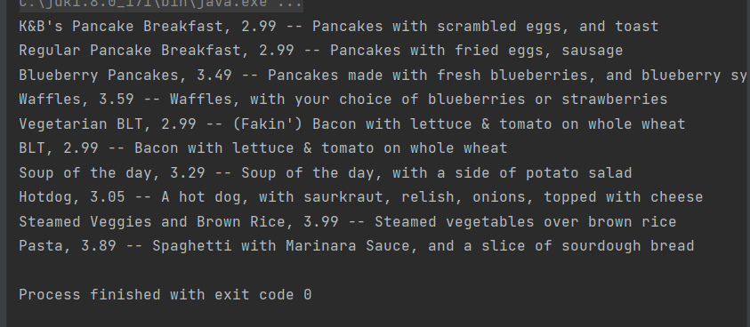

# 반복자 패턴

# 반복자 패턴 언제 필요할까?

컬렉션은 객체를 모아 놓은 것이죠

배열, 스택…

이런 다양한 컬렉션을 사용할 때 클라이언트가 컬렉션에 들어있는 모든 객체에 일일이 접근하고 싶은 상황이 생긴다면 각각의 객체 저장 방식을 알아야 접근이 가능할까요?

객체 저장 방식을 보여 주지 않으면서도 클라이언트가 객체에 일일이 접근할 수 있는 방법이 있으면 좋을 것 같습니다

여기에 해당하는 패턴을 알아봅시다!

## 예시 : 식당과 디저트 가게의 합병

- 먼저 메뉴 항목을 구현하는 방법인 **MenuItem 클래스** 구현방법은 합의를 했어요!
    
    ```java
    package headfirst.designpatterns.iterator.dinermergercafe;
    
    public class MenuItem {
    	String name;
    	String description;
    	boolean vegetarian;
    	double price;
     
    	public MenuItem(String name, 
    	                String description, 
    	                boolean vegetarian, 
    	                double price) 
    	{
    		this.name = name;
    		this.description = description;
    		this.vegetarian = vegetarian;
    		this.price = price;
    	}
      
    	public String getName() {
    		return name;
    	}
      
    	public String getDescription() {
    		return description;
    	}
      
    	public double getPrice() {
    		return price;
    	}
      
    	public boolean isVegetarian() {
    		return vegetarian;
    	}
    }
    ```
    
- 문제는 이 MenuItem을 항목으로 다루는 **Menu 구현법이 다르다**고 합니다
    - PancakeHouseMenu 클래스
        
        ```java
        package headfirst.designpatterns.iterator.dinermergercafe;
        
        import java.util.ArrayList;
        
        public class PancakeHouseMenu {
        	ArrayList<MenuItem> menuItems;
         
        	public PancakeHouseMenu() {
        		menuItems = new ArrayList<MenuItem>();
            
        		addItem("K&B's Pancake Breakfast", 
        			"Pancakes with scrambled eggs and toast", 
        			true,
        			2.99);
         
        		addItem("Regular Pancake Breakfast", 
        			"Pancakes with fried eggs, sausage", 
        			false,
        			2.99);
         
        		addItem("Blueberry Pancakes",
        			"Pancakes made with fresh blueberries and blueberry syrup",
        			true,
        			3.49);
         
        		addItem("Waffles",
        			"Waffles with your choice of blueberries or strawberries",
        			true,
        			3.59);
        	}
        
        	public void addItem(String name, String description,
        	                    boolean vegetarian, double price)
        	{
        		MenuItem menuItem = new MenuItem(name, description, vegetarian, price);
        		menuItems.add(menuItem);
        	}
         
        	public ArrayList<MenuItem> getMenuItems() {
        		return menuItems;
        	}
          
        	// other menu methods here
        }
        ```
        
    - DinerMenu 클래스
        
        ```java
        package headfirst.designpatterns.iterator.dinermergercafe;
        
        public class DinerMenu {
        	static final int MAX_ITEMS = 6;
        	int numberOfItems = 0;
        	MenuItem[] menuItems;
          
        	public DinerMenu() {
        		menuItems = new MenuItem[MAX_ITEMS];
         
        		addItem("Vegetarian BLT",
        			"(Fakin') Bacon with lettuce & tomato on whole wheat", true, 2.99);
        		addItem("BLT",
        			"Bacon with lettuce & tomato on whole wheat", false, 2.99);
        		addItem("Soup of the day",
        			"Soup of the day, with a side of potato salad", false, 3.29);
        		addItem("Hotdog",
        			"A hot dog, with sauerkraut, relish, onions, topped with cheese",
        			false, 3.05);
        		addItem("Steamed Veggies and Brown Rice",
        			"A medly of steamed vegetables over brown rice", true, 3.99);
        		addItem("Pasta",
        			"Spaghetti with Marinara Sauce, and a slice of sourdough bread",
        			true, 3.89);
        	}
          
        	public void addItem(String name, String description, 
        	                     boolean vegetarian, double price) 
        	{
        		MenuItem menuItem = new MenuItem(name, description, vegetarian, price);
        		if (numberOfItems >= MAX_ITEMS) {
        			System.err.println("Sorry, menu is full!  Can't add item to menu");
        		} else {
        			menuItems[numberOfItems] = menuItem;
        			numberOfItems = numberOfItems + 1;
        		}
        	}
         
        	public MenuItem[] getMenuItems() {
        		return menuItems;
        	}
         
        	// other menu methods here
        }
        ```
        
        메뉴에 의존하는 코드도 많이 만들었습니다.
        

### 메뉴 구현 방식이 서로 다름으로써 생기는 문제를 알아봅시다

- 메뉴 항목을 호출해 봅시다!
    
    ```java
    PancakeHouseMenu pancakeHouseMenu = new PancakeHouseMenu();
    		DinerMenu dinerMenu = new DinerMenu();
    		
    		// with no iterators
    		System.out.println("\nMENU\n----\nBREAKFAST");
    		ArrayList<String> breakfastItems = pancakeHouseMenu.getMenuItems();
    		for (int i = 0; i < breakfastItems.size(); i++) {
    			String menuItem = (String)breakfastItems.get(i);
    			System.out.println(menuItem);
    		}
    
    		System.out.println("\nLUNCH");
    		String[] lunchItems = dinerMenu.getMenuItems();
    
    		for (int i = 0; i < lunchItems.length; i++) {
    			String menuItem = lunchItems[i];
    			System.out.println(menuItem);
    		}
    ```
    
    - 반복문 중복
    - 메소드 이름은 같지만 리턴 형식은 다름
    

### 반복을 캡슐화 해봅시다!

위에 코드의 반복문에서 사이즈를 체크해서 i번째 항목을 들고온다는 점이 반복 됩니다!

- 사이즈 체크 : size(), length
- i번째 항목 : .get(i), 배열[i]

⇒ 반복 작업 처리방법을 캡슐화한 iterator객체를 만들어 봅시다

```java
Iterator iterater = breakfastMenu.createIterator();
 
while(iterator.hasNext()){
	MenuItem menuItem = iterator.next();
}
```

## 반복자 패턴 알아보기

반복자 패턴은 Iterator 인터페이스에 의존합니다.

이 인터페이스로 배열, 리스트, 해시테이블 등 모든 종류의 객체 컬렉션에 반복자를 구현할 수 있게 됩니다.

- Iterator 인터페이스
    
    ```java
    public interface Iterator {
    	boolean hasNext();
    	MenuItem next();
    }
    ```
    
- 구상 클래스
    - DinerMenuIterator
        
        ```java
        package headfirst.designpatterns.collections.iterator;
        
        public class DinerMenuIterator implements Iterator {
        	String[] items;
        	int position = 0; //반복 작업이 처리되고 있는 위치
         
        	public DinerMenuIterator(String[] items) {
        		this.items = items;
        	}
         
        	public String next() {
        		String menuItem = items[position];
        		position = position + 1;
        		return menuItem;
        	}
         
        	public boolean hasNext() {
        		if (position >= items.length || items[position] == null) {
        			return false;
        		} else {
        			return true;
        		}
        	}
        }
        ```
        
- DinerMenu클래스에서 반복자 사용
    
    ```java
    package headfirst.designpatterns.collections.iterator;
    
    public class DinerMenu implements Menu {
    	static final int MAX_ITEMS = 6;
    	int numberOfItems = 0;
    	String[] menuItems;
      
    	public DinerMenu() {
    		menuItems = new String[MAX_ITEMS];
     
    		addItem("Vegetarian BLT");
    		addItem("BLT");
    		addItem("Soup of the day");
    		addItem("Hotdog");
    		addItem("Steamed Veggies and Brown Rice");
    		addItem("Pasta");
    	}
      
    	public void addItem(String name) 
    	{
    		if (numberOfItems >= MAX_ITEMS) {
    			System.err.println("Sorry, menu is full!  Can't add item to menu");
    		} else {
    			menuItems[numberOfItems] = name;
    			numberOfItems = numberOfItems + 1;
    		}
    	}
    
    // 이제 필요없음!
    //	public String[] getMenuItems() {
    //		return menuItems;
    //	}
      
    //여기서 사용!!!
    	public Iterator createIterator() {
    		return new DinerMenuIterator(menuItems);
    	}
     
    	public String toString() {
    		return "Diner Menu";
    	}
    	// other menu methods here
    }
    ```
    
    어떤 식으로 구현되어있는지 알 필요 없이 접근 가능해짐!
    
- 종업원에 반복자 적용
    
    ```java
    public class Waitress {
    	Menu pancakeHouseMenu;
    	Menu dinerMenu;
     
    	public Waitress(Menu pancakeHouseMenu, Menu dinerMenu) {
    		this.pancakeHouseMenu = pancakeHouseMenu;
    		this.dinerMenu = dinerMenu;
    	}
     
    	public void printMenu() {
    	//반복자 생성후
    		Iterator pancakeIterator = pancakeHouseMenu.createIterator();
    		Iterator dinerIterator = dinerMenu.createIterator();
    
    	// 메소드에 넘김
    		System.out.println("MENU\n----\nBREAKFAST");
    		printMenu(pancakeIterator);
    		System.out.println("\nLUNCH");
    		printMenu(dinerIterator);
    
    	}
     
    //오버로드
    	private void printMenu(Iterator iterator) {
    		while (iterator.hasNext()) {
    			MenuItem menuItem = iterator.next();
    			System.out.print(menuItem.getName() + ", ");
    			System.out.print(menuItem.getPrice() + " -- ");
    			System.out.println(menuItem.getDescription());
    		}
    	}
    ...
    ```
    
- Test!!
    
    ```java
    package headfirst.designpatterns.iterator.implicit;
    
    public class MenuTestDrive {
    	public static void main(String args[]) {
    		PancakeHouseMenu pancakeHouseMenu = new PancakeHouseMenu();
    		DinerMenu dinerMenu = new DinerMenu();
    		Waitress waitress = new Waitress(pancakeHouseMenu, dinerMenu);
    		// Use implicit iteration
    		waitress.printMenu();
    	}
    }
    ```
    
    Vegetarian BLT부터가 Dinermenu 위에는 pancakeHouseMenu
    
    
    
    종업원은 메뉴생성자만 얻으면 메뉴를 프린트 할 수 있게됨.
    

### 인터페이스를 개선해보겠습니다.

- java.util.Iterator사용하기
    
    ```java
    package java.util;
    
    public interface Iterator<E> {
        boolean hasNext();
        E next();
        default void remove() {
            throw new UnsupportedOperationException("remove");
        }
    ```
    
- Menu인터페이스
    
    ```java
    import java.util.Iterator;
    
    public interface Menu {
    	public Iterator<MenuItem> createIterator();
    }
    ```
    
- Menu 구현 클래스에서 createIterator 메소드
    
    ```java
    public Iterator<MenuItem> createIterator() {
    		return menuItems.iterator();
    	}
    ```
    
- 이렇게 하면 Waitress 클래스가 조금 더 깔끔해 질 수 있습니다
    
    ```java
    public class Waitress {
    	Menu pancakeHouseMenu;
    	Menu dinerMenu;
     
    	public Waitress(Menu pancakeHouseMenu, Menu dinerMenu) {
    		this.pancakeHouseMenu = pancakeHouseMenu;
    		this.dinerMenu = dinerMenu;
    	}
    ...아래는 동일
    ```
    

# 반복자 패턴(Iterator Pattern)

: 컬렉션의 구현 방법을 노출하지 않으면서 집합체 내의 모든 항목에 접근하는 방법을 제공합니다.

## 단일 역할 원칙

어떤 클래스가 바뀌는 이유는 하나뿐이어야 한다.

- 변경과 관련된 디자인 원칙

### 새로운 메뉴가 추가된다면?

createIterator()를 프린트메뉴에 추가를 해야합니다.

이러면 OCP(Open Closed Principle)에 위배가 됩니다.

또한, 메뉴의 서브메뉴 기능을 추가하려 합니다.

ex) DinerMenu의 컬렉션 원소에 디저트 메뉴 추가..

⇒ 메뉴, 서브메뉴, 메뉴 항목 등을 모두 넣을 수 있는 트리 형태의 구조 필요


# 컴포지트 패턴(Composite Pattern)

객체를 트리구조로 구성해서 **부분-전체 계층구조**를 구현합니다.

- 클라이언트에서 개별 객체와 복합 객체를 똑같은 방법으로 다룰 수 있다.

> **부분-전체 계층(part-whole hierarchy)**
> 
> 
> 부분(메뉴 및 메뉴 항목)들이 계층을 이루고 있지만 
> 모든 부분을 묶어서 전체로 다룰 수 있는 구조
> 

⇒ 개별 객체와 복합 객체에도 똑같은 방식을 적용할 수 있다.
    ( = 개별 객체도 메뉴다)

- 메뉴 구성 요소
    - MenuComponent 추상 클래스
        
        leaf와 복합 노드 모두에서 쓰이는 인터페이스 역할을 함.
        
        ```java
        package headfirst.designpatterns.composite.menu;
        
        public abstract class MenuComponent {
           //MenuComponent를 추가하거나 제거하고 가져오는 메소드
        	public void add(MenuComponent menuComponent) {
        		throw new UnsupportedOperationException();
        	}
        	public void remove(MenuComponent menuComponent) {
        		throw new UnsupportedOperationException();
        	}
        	public MenuComponent getChild(int i) {
        		throw new UnsupportedOperationException();
        	}
          
        	// MenuItem에서 작업을 ㅓ리하는 메소드
        	// 이중 몇개는 Menu에서도 사용 가능한것이 있다.
        	public String getName() {
        		throw new UnsupportedOperationException();
        	}
        	public String getDescription() {
        		throw new UnsupportedOperationException();
        	}
        	public double getPrice() {
        		throw new UnsupportedOperationException();
        	}
        	public boolean isVegetarian() {
        		throw new UnsupportedOperationException();
        	}
          
        	public void print() {
        		throw new UnsupportedOperationException();
        	}// Menu와 MenuItem에서 모두 구현하는 작업용 메소드
        }
        ```
        
        - Exception을 던지는 이유
            
            어떤 메소드는 MenuItem에서만 쓸 수 있고
            
            어떤 메소드는 Menu에서만 쓸 수 있기 때문에 예외처리를 해줌
            
- 메뉴 항목
    - MenuItem 클래스
        
        ```java
        package headfirst.designpatterns.composite.menu;
        
        public class MenuItem extends MenuComponent {
        	String name;
        	String description;
        	boolean vegetarian;
        	double price;
            
        	public MenuItem(String name, 
        	                String description, 
        	                boolean vegetarian, 
        	                double price) 
        	{ 
        		this.name = name;
        		this.description = description;
        		this.vegetarian = vegetarian;
        		this.price = price;
        	}
          
        	public String getName() {
        		return name;
        	}
          
        	public String getDescription() {
        		return description;
        	}
          
        	public double getPrice() {
        		return price;
        	}
          
        	public boolean isVegetarian() {
        		return vegetarian;
        	}
          
        	//오버라이드!! 
        	// 메뉴에 수록해야할 모든내용(이름,설명,가격,채식주의자용 식단여부)출력
        	public void print() {
        		System.out.print("  " + getName());
        		if (isVegetarian()) {
        			System.out.print("(v)");
        		}
        		System.out.println(", " + getPrice());
        		System.out.println("     -- " + getDescription());
        	}
        }
        ```
        
- 메뉴
    - Menu클래스
        
        ```java
        package headfirst.designpatterns.composite.menu;
        
        import java.util.Iterator;
        import java.util.ArrayList;
        
        public class Menu extends MenuComponent {
        	//MenuComponent 형식의 자식들 저장
        	ArrayList<MenuComponent> menuComponents = new ArrayList<MenuComponent>();
        	String name;
        	String description;
          
        	public Menu(String name, String description) {
        		this.name = name;
        		this.description = description;
        	}
         
        //MenuItem이나 다른 Menu를 추가하는 코드
        //MenuItem Menu 모두 MenuComponent -> 한메소드로 처리 가능
        	public void add(MenuComponent menuComponent) {
        		menuComponents.add(menuComponent);
        	}
         
        	public void remove(MenuComponent menuComponent) {
        		menuComponents.remove(menuComponent);
        	}
         
        	public MenuComponent getChild(int i) {
        		return (MenuComponent)menuComponents.get(i);
        	}
         
        	public String getName() {
        		return name;
        	}
         
        	public String getDescription() {
        		return description;
        	}
         
        	//오버라이드 메뉴 이름과 설명 출력
        	public void print() {
        		System.out.print("\n" + getName());
        		System.out.println(", " + getDescription());
        		System.out.println("---------------------");
          
        		Iterator<MenuComponent> iterator = menuComponents.iterator();
        		while (iterator.hasNext()) {
        			MenuComponent menuComponent = 
        				(MenuComponent)iterator.next();
        			menuComponent.print();
        		}
        	}
        }
        ```
        
- 종업원 코드에 컴포지트 적용
    - Waitress
        
        ```java
        package headfirst.designpatterns.composite.menu;
          
        public class Waitress {
        	MenuComponent allMenus;
         
        	//최상위 메뉴 구성요소만 넘겨주면 된다.
        	public Waitress(MenuComponent allMenus) {
        		this.allMenus = allMenus;
        	}
         
        	public void printMenu() {
        		allMenus.print();
        	}
        }
        ```
        
- Test
    
    ```java
    package headfirst.designpatterns.composite.menu; 
    
    public class MenuTestDrive {
    	public static void main(String args[]) {
    		MenuComponent pancakeHouseMenu = 
    			new Menu("PANCAKE HOUSE MENU", "Breakfast");
    		MenuComponent dinerMenu = 
    			new Menu("DINER MENU", "Lunch");
    		MenuComponent cafeMenu = 
    			new Menu("CAFE MENU", "Dinner");
    		MenuComponent dessertMenu = 
    			new Menu("DESSERT MENU", "Dessert of course!");
    		MenuComponent coffeeMenu = new Menu("COFFEE MENU", "Stuff to go with your afternoon coffee");
      
    		MenuComponent allMenus = new Menu("ALL MENUS", "All menus combined");
      
    		allMenus.add(pancakeHouseMenu);
    		allMenus.add(dinerMenu);
    		allMenus.add(cafeMenu);
      
    		pancakeHouseMenu.add(new MenuItem(
    			"K&B's Pancake Breakfast", 
    			"Pancakes with scrambled eggs and toast", 
    			true,
    			2.99));
    		pancakeHouseMenu.add(new MenuItem(
    			"Regular Pancake Breakfast", 
    			"Pancakes with fried eggs, sausage", 
    			false,
    			2.99));
    		pancakeHouseMenu.add(new MenuItem(
    			"Blueberry Pancakes",
    			"Pancakes made with fresh blueberries, and blueberry syrup",
    			true,
    			3.49));
    		pancakeHouseMenu.add(new MenuItem(
    			"Waffles",
    			"Waffles with your choice of blueberries or strawberries",
    			true,
    			3.59));
    
    		dinerMenu.add(new MenuItem(
    			"Vegetarian BLT",
    			"(Fakin') Bacon with lettuce & tomato on whole wheat", 
    			true, 
    			2.99));
    		dinerMenu.add(new MenuItem(
    			"BLT",
    			"Bacon with lettuce & tomato on whole wheat", 
    			false, 
    			2.99));
    		dinerMenu.add(new MenuItem(
    			"Soup of the day",
    			"A bowl of the soup of the day, with a side of potato salad", 
    			false, 
    			3.29));
    		dinerMenu.add(new MenuItem(
    			"Hot Dog",
    			"A hot dog, with saurkraut, relish, onions, topped with cheese",
    			false, 
    			3.05));
    		dinerMenu.add(new MenuItem(
    			"Steamed Veggies and Brown Rice",
    			"Steamed vegetables over brown rice", 
    			true, 
    			3.99));
     
    		dinerMenu.add(new MenuItem(
    			"Pasta",
    			"Spaghetti with marinara sauce, and a slice of sourdough bread",
    			true, 
    			3.89));
       
    		dinerMenu.add(dessertMenu);
      
    		dessertMenu.add(new MenuItem(
    			"Apple Pie",
    			"Apple pie with a flakey crust, topped with vanilla icecream",
    			true,
    			1.59));
      
    		dessertMenu.add(new MenuItem(
    			"Cheesecake",
    			"Creamy New York cheesecake, with a chocolate graham crust",
    			true,
    			1.99));
    		dessertMenu.add(new MenuItem(
    			"Sorbet",
    			"A scoop of raspberry and a scoop of lime",
    			true,
    			1.89));
    
    		cafeMenu.add(new MenuItem(
    			"Veggie Burger and Air Fries",
    			"Veggie burger on a whole wheat bun, lettuce, tomato, and fries",
    			true, 
    			3.99));
    		cafeMenu.add(new MenuItem(
    			"Soup of the day",
    			"A cup of the soup of the day, with a side salad",
    			false, 
    			3.69));
    		cafeMenu.add(new MenuItem(
    			"Burrito",
    			"A large burrito, with whole pinto beans, salsa, guacamole",
    			true, 
    			4.29));
    
    		cafeMenu.add(coffeeMenu);
    
    		coffeeMenu.add(new MenuItem(
    			"Coffee Cake",
    			"Crumbly cake topped with cinnamon and walnuts",
    			true,
    			1.59));
    		coffeeMenu.add(new MenuItem(
    			"Bagel",
    			"Flavors include sesame, poppyseed, cinnamon raisin, pumpkin",
    			false,
    			0.69));
    		coffeeMenu.add(new MenuItem(
    			"Biscotti",
    			"Three almond or hazelnut biscotti cookies",
    			true,
    			0.89));
     
    		Waitress waitress = new Waitress(allMenus);
       
    		waitress.printMenu();
    	}
    }
    ```
    
    ```java
    결과
    
    C:\jdk1.8.0_171\bin\java.exe "-javaagent:C:\Program Files\JetBrains\IntelliJ IDEA 2022.1.2\lib\idea_rt.jar=58948:C:\Program Files\JetBrains\IntelliJ IDEA 2022.1.2\bin" -Dfile.encoding=UTF-8 -classpath C:\jdk1.8.0_171\jre\lib\charsets.jar;C:\jdk1.8.0_171\jre\lib\deploy.jar;C:\jdk1.8.0_171\jre\lib\ext\access-bridge-64.jar;C:\jdk1.8.0_171\jre\lib\ext\cldrdata.jar;C:\jdk1.8.0_171\jre\lib\ext\dnsns.jar;C:\jdk1.8.0_171\jre\lib\ext\jaccess.jar;C:\jdk1.8.0_171\jre\lib\ext\jfxrt.jar;C:\jdk1.8.0_171\jre\lib\ext\localedata.jar;C:\jdk1.8.0_171\jre\lib\ext\nashorn.jar;C:\jdk1.8.0_171\jre\lib\ext\sunec.jar;C:\jdk1.8.0_171\jre\lib\ext\sunjce_provider.jar;C:\jdk1.8.0_171\jre\lib\ext\sunmscapi.jar;C:\jdk1.8.0_171\jre\lib\ext\sunpkcs11.jar;C:\jdk1.8.0_171\jre\lib\ext\zipfs.jar;C:\jdk1.8.0_171\jre\lib\javaws.jar;C:\jdk1.8.0_171\jre\lib\jce.jar;C:\jdk1.8.0_171\jre\lib\jfr.jar;C:\jdk1.8.0_171\jre\lib\jfxswt.jar;C:\jdk1.8.0_171\jre\lib\jsse.jar;C:\jdk1.8.0_171\jre\lib\management-agent.jar;C:\jdk1.8.0_171\jre\lib\plugin.jar;C:\jdk1.8.0_171\jre\lib\resources.jar;C:\jdk1.8.0_171\jre\lib\rt.jar;C:\jepa\study\Head-First-Design-Patterns-master\out\production\Head-First-Design-Patterns-master;C:\jepa\study\Head-First-Design-Patterns-master\lib\javax.jms.jar;C:\jepa\study\Head-First-Design-Patterns-master\lib\javax.transaction.jar;C:\jepa\study\Head-First-Design-Patterns-master\lib\javax.annotation.jar;C:\jepa\study\Head-First-Design-Patterns-master\lib\javax.resource.jar;C:\jepa\study\Head-First-Design-Patterns-master\lib\javax.ejb.jar;C:\jepa\study\Head-First-Design-Patterns-master\lib\javax.servlet.jsp.jar;C:\jepa\study\Head-First-Design-Patterns-master\lib\javax.persistence.jar;C:\jepa\study\Head-First-Design-Patterns-master\lib\javax.servlet.jar;C:\jepa\study\Head-First-Design-Patterns-master\lib\javax.servlet.jsp.jstl.jar headfirst.designpatterns.composite.menu.MenuTestDrive
    
    ALL MENUS, All menus combined
    ---------------------
    
    PANCAKE HOUSE MENU, Breakfast
    ---------------------
      K&B's Pancake Breakfast(v), 2.99
         -- Pancakes with scrambled eggs and toast
      Regular Pancake Breakfast, 2.99
         -- Pancakes with fried eggs, sausage
      Blueberry Pancakes(v), 3.49
         -- Pancakes made with fresh blueberries, and blueberry syrup
      Waffles(v), 3.59
         -- Waffles with your choice of blueberries or strawberries
    
    DINER MENU, Lunch
    ---------------------
      Vegetarian BLT(v), 2.99
         -- (Fakin') Bacon with lettuce & tomato on whole wheat
      BLT, 2.99
         -- Bacon with lettuce & tomato on whole wheat
      Soup of the day, 3.29
         -- A bowl of the soup of the day, with a side of potato salad
      Hot Dog, 3.05
         -- A hot dog, with saurkraut, relish, onions, topped with cheese
      Steamed Veggies and Brown Rice(v), 3.99
         -- Steamed vegetables over brown rice
      Pasta(v), 3.89
         -- Spaghetti with marinara sauce, and a slice of sourdough bread
    
    DESSERT MENU, Dessert of course!
    ---------------------
      Apple Pie(v), 1.59
         -- Apple pie with a flakey crust, topped with vanilla icecream
      Cheesecake(v), 1.99
         -- Creamy New York cheesecake, with a chocolate graham crust
      Sorbet(v), 1.89
         -- A scoop of raspberry and a scoop of lime
    
    CAFE MENU, Dinner
    ---------------------
      Veggie Burger and Air Fries(v), 3.99
         -- Veggie burger on a whole wheat bun, lettuce, tomato, and fries
      Soup of the day, 3.69
         -- A cup of the soup of the day, with a side salad
      Burrito(v), 4.29
         -- A large burrito, with whole pinto beans, salsa, guacamole
    
    COFFEE MENU, Stuff to go with your afternoon coffee
    ---------------------
      Coffee Cake(v), 1.59
         -- Crumbly cake topped with cinnamon and walnuts
      Bagel, 0.69
         -- Flavors include sesame, poppyseed, cinnamon raisin, pumpkin
      Biscotti(v), 0.89
         -- Three almond or hazelnut biscotti cookies
    
    Process finished with exit code 0
    ```