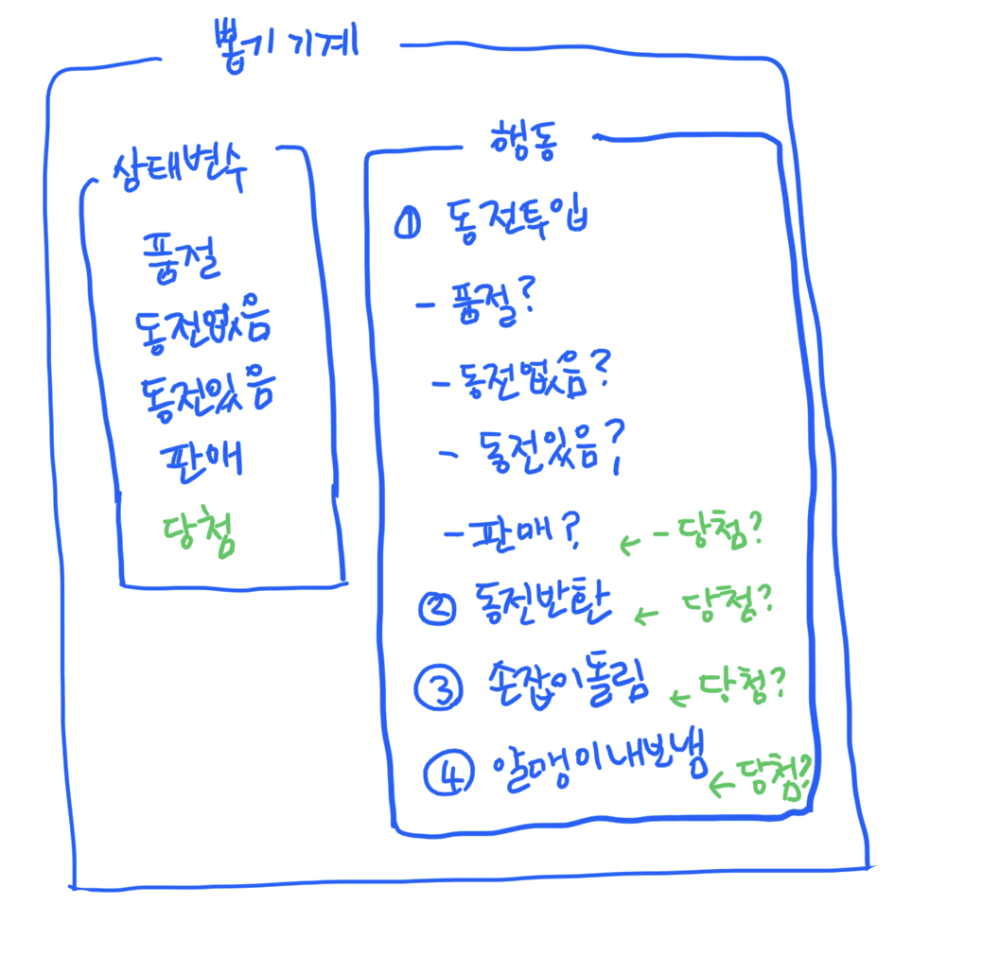
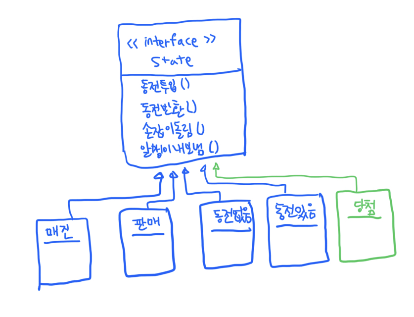
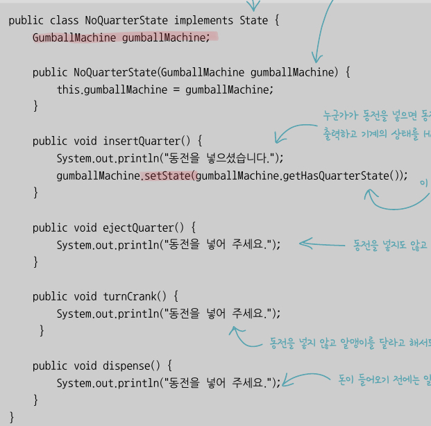
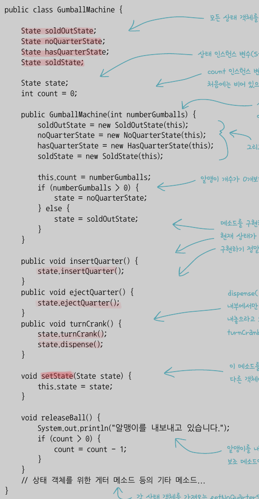
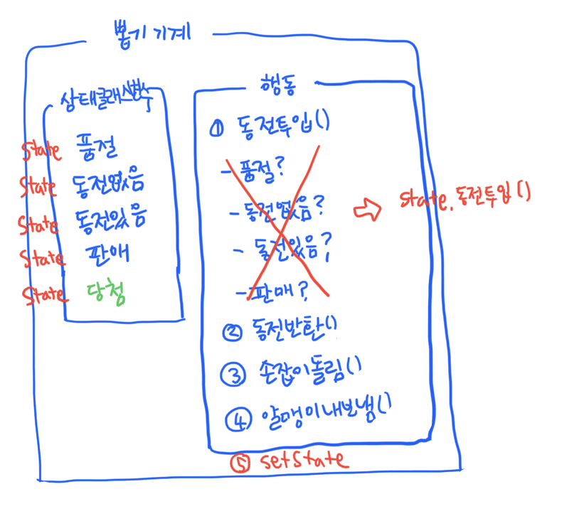
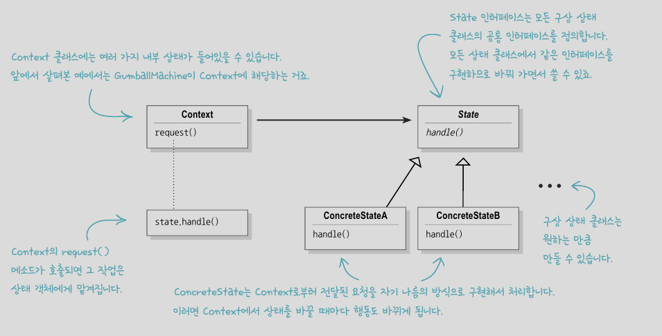

# 10. 상태 패턴

싱태 패턴을 사용하면 객체의 내부 상태가 바뀜에 따라서 객체의 행동을 바꿀 수 있어 마치 객체의 클래스가 바뀌는 것과 같은 결과를 얻을 수 있다.

 

## # 뽑기 기계 예제

 

###  1. 초기 디자인 구상

 

-> 바뀌는 부분을 캡슐화하지 않음

-> 새로운 기능을 추가하는 과정에서 기존 코드에 없던 새로운 버그가 생길 가능성

-> 조건문 속에 상태 전환이 숨어 있어 분명하게 드러나지 않음

 

### 2. 상태 패턴

 

상태 객체들을 별도의 코드에 넣어 상태 클래스를 구현해 보자.

 

 

-> 상태 클래스에서 구현할 State 인터페이스를 만들고,

-> 모든 상태를 캡슐화하여 State 인터페이스를 구현하는 클래스를 만든다

 

 

- 각 상태의 행동을 별개의 클래스로 캡슐화
 (현재 상태를 나타내는 객체에게 행동을 위임))

- 조건문 삭제

- OCP 원칙: 변경에는 닫혀 있고, 확장에는 열려 있도록!

 

🔻 상태 패턴 클래스 다이어그램

 

