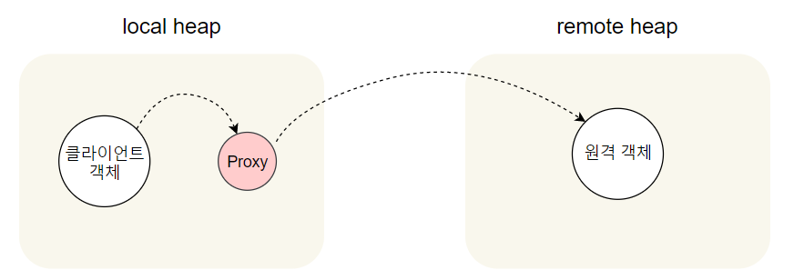

# proxy_pattern

상태 정보를 객체에서 바로 정보를 읽어오는 와서 모니터링을 하는 것이 아닌
원격으로 모니터링을 하고 싶습니다.

이를 위해 `원격 프록시` 라는 개념을 배워 봅시다!

## 원격 프록시

- 원격 프록시는 **원격 객체**의 **로컬 대변자** 역할을 합니다.
    
    
    
    > **원격 객체란?**
    > 
    > 
    > 다른 JVM의 heap에 살고 있는 객체
    > (= 다른 주소 공간에서 돌아가고 있는 객체)
    > 
    
    > **로컬 대변자란?**
    > 
    > 
    > 로컬 대변자의 메소드 호출 시, **다른 원격 객체에게 메소드 호출을 전달**해 주는 객체
    > 
    - 클라이언트 객체는 원격 객체의 메소드를 호출 하는 것처럼 행동
        
        (실제로는 local heap에 있는 Proxy객체의 메소드를 호출)
        
    - 네트워크 통신과 관련된 저수준 작업은 이 Proxy 객체에서 처리해줌
    

## 자바의 원격 메소드 호출(RMI, Remote Method Invocation)

RMI를 사용 시 원격 JVM에 있는 객체를 찾아서 해당 메소드를 호출할 수 있다.

### 원격 메소드의 기초


- 원격 메소드 호출
    1. 클라이언트가 **클라이언트 보조 객체의 메소드를 호출**합니다.
        
        클라이언트는 클라이언트 보조 객체에서 원하는 작업을 처리한다고 생각해
        진짜 서비스 메소드를 호출하는 것으로 생각하지만 프록시의 메소드를 호출할 뿐입니다.
        
        > 클라이언트 보조 객체는 진짜 서비스인 척하는 Proxy일 뿐 입니다.
        > 
    2. 클라이언트 보조 객체에서 **서비스 보조 객체에게 요청**을 합니다.
        
        클라이언트 보조 객체는 서버에 연락을 취한 후
        **메소드 호출에 관한 정보(메소드 이름, 인자 등)을 전달**하고 
        서버로부터 리턴 정보를 기다립니다.
        
    3. 서비스 보조 객체는 Socket연결을 이용해  요청을 받고 
    받은 요청을 해석(어떤 객체의 어떤 메소드를 호출할지)해서 **진짜 서비스 객체에 있는 메소드를 호출**합니다.
    4. 서비스 보조 객체는 서비스로부터 리턴을 받습니다. 
    5. 서비스 보조 객체가 Socket의 출력 스트림(네트워크)으로 
    정보를 포장해서 클라이언트 보조 객체에게 전송힙니다
    6. 클라이언트 보조 객체는 받은 정보를 해석해서 클라이언트 객체에게 리턴합니다.
    
    ⇒ 클라이언트 객체는 메소드 호출이 어디로 전달되었는지, 어디에서 리턴되었는지 알 수 없다.
    

> **자바 RMI**
> 
> - RMI가 클라이언트와 서비스 보조 객체를 만들어 줍니다.
>     - 보조객체에는 원격 서비스와 똑같은 메소드가 들어있다.
> - RMI를 사용하면 네트워킹 및 입출력 관련 코드를 직접 작성하지 않아도 된다.
> - 같은 로컬 JVM에 있는 메소드를 호출하듯 원격 메소드 호출 가능
> - 룩업(lookup)서비스 제공
>     - 룩업 서비스 : 원격 객체를 찾아서 접근할 때 사용
> - 네트워킹이나 및 입출력 기능이 필요
>     
>     → 문제 발생 대비 필요
>     
> 
> > **RMI 용어**
> > 
> > - stub(스텁) : 클라이언트 보조 객체
> > - skeleton(스켈레톤) : 서비스 보조 객체

## 원격 서비스 만들기

### 1단계 : 원격 인터페이스 만들기

- 원격 인터페이스는 클라이언트가 **원격**으로 호출할 **메소드를 정의**
    - stub과 실제 서비스는 이 인터페이스를 구현
    1. `java.rmi.Remote` (= 표식용(marker)인터페이스)구현
        
        `public interface MyRemote extends Remote{`
        
    2. 모든 메소드를 RemoteException을 던지도록 선언
        
        ```java
        import java.rmi.*;
        
        public interface MyRemote extends Remote{
        	public String sayHello() throws RemoteException;
        }
        ```
        
        - Exception을 던짐으로써
            - 원격의 stub 메소드를 호출하기때문에 네트워크 예외 상황에 대한 대비를 할 수 있음
            - 해당 인터페이스 형식의 레퍼런스에 관한 메소드를 호출하는 코드에서 예외 처리 or선언 필요
    3. 원격 메소드의 인자와 리턴값은 원시(primitive) 타입 또는 Serializable(직렬화) 타입으로 선언
        
        `public String sayHello() throws RemoteException;`
        
        - 원격 메소드의 인자와 리턴값은 모두 네트워크로 전달되어야 하며 직렬화로 포장됨.
            
            (= 직렬화 될 수 있어야 한다)
            
        - 원시 형식이나 String or API에서 많이 쓰이는 일반적인 형식(배열, 컬렉션)등을 사용하면 문제 없음.
            - 직접 만든 형식을 전달한다면 클래스를 만들 때 Serializable 인터페스도 구현 필요

### 2단계 : 서비스 구현 클래스 만들기

- 원격 메소드 구현하기
    
    ```java
    import java.rmi.*;
    import java.rmi.server.*;
    
    public class MyRemoteImpl extends UnicastRemoteObject implements MyRemote {
    	private static final long serialVersionUID = 1L;
    	//2. UnicastRemoteObject는 Serializable을 구현하므로 serialVersionUID필요
    
    	//1. 
    	public String sayHello(){
    		return "Server says, Hey"
    	}
    
    	//3.
    	public MyRemoteImpl() throws RemoteException {}
    
    	//4.
    	public static void main(String[] args){
    		try{
    			MyRemote service service = new MyRemoteImpl();
    			Naming.rebind("RemoteHello", service);
    		} catch(Exception ex) {
    			ex.printStackTrace();
    		}
    	}
    ```
    
    1. 서비스 클래스에 원격 인터페이스 구현 
    2. `UnicatstRemoteObject`(java.rmi.server 패키지에 들어있음)를 확장
        - 객체에 `원격객체` 기능을 추가해줌
    3. RemoteException을 선언하는 생성자 구현
        - `UnicatstRemoteObject`에서 생성자가 RemoteException을 던짐
            
            → 서비스 구현하는 클래스에 RemoteException 선언하는 생성자 필요
            
    4. 서비스를 RMI 레지스트리에 등록
        - 원격 클라이언트에서 사용할 수 있게 만듦
        - 서비스를 구현한 객체 등록 시, RMI시스템이 레지스트리에 스텁만 등록
            
            (클라이언트는 스텁만 필요하기 때문)
            
        - rebind() : java.rmi.Naming클래스에 있는 정적 메소드
            - 서비스를 등록해준다.

### 3단계 : RMI 레지스트리(rmiregistry)실행하기

- 이 레지스트리로부터 프록시(= stub = 클라이언트 보조 객체)를 받아감
- 터미널을 띄워서 rmiregistry 실행
    
    ```java
    %rmiregistry 
    ```
    
    클래스에 접근할 수 있는 디렉토리에서 실행해야 함 (classes 디렉토리에서 실행하면 됨)
    

### 4단계 : 원격 서비스 실행하기

- 구현한 클래스에서 서비스의 인스턴스를 만들고 해당 인스턴스를 RMI레지스트리에 등록
    
    ⇒ 클라이언트에서 사용 가능해짐.
    
    (stub과 skeleton은 보이지 않는 곳에서 동적으로 생성됨)
    
- 다른 터미널을 열고 서비스 실행
    
    ```java
    $java MyRemoteImpl
    ```
    

### RMI 레지스트리가 룩업기능을 제공

- 클라이언트가 룩업으로 스텁 객체 요청
    - 이름 주면서 해당 이름에 맞는 스텁 객체 요구
    
    ```java
    MyRemote service = (MyRemote) Naming.lookup("rmi://127.0.0.1/RemoteHello");
    ```
    
    - `MyRemote` : 원격 인터페이스 형식 (구현 클래스 이름은 알 필요 없음)
    - `rmi://127.0.0.1/RemoteHello` : 서비스가 돌아가고 있는 시스템의 호스트 이름 or IP주소
    - `RemoteHello` : 서비스 등록할 때 사용한 이름
    - `lookup()` : Naming 클래스에 있는 정적 메소드
    - (MyRemote) : 리턴된 스텁은 인터페이스 형식으로 캐스팅
        - lookup은 Object형식 객체 리턴함

### 클라이언트 코드

```java
import java.rmi.*;

public class MyRemoteClient {
	public static void main (String[] args){
		new MyRemoteClient().go();
	}
	public void go(){
		try{
			MyRemote service = (MyRemote) Naming.lookup("rmi://127.0.0.1/RemoteHello");

			String s= servie.sayHello(); 
			//일반 메소드 호출하듯이 호출가능
			//단, 예외처리 신경써줘야함
			System.out.println(s);
		} catch(Exception ex){
			ex.printStackTrace();
		}
	}
```

## 뽑기 기계용 원격 프록시(479~488)

- MyRemoteClient = GumballMonitor
- MyRemote = GumballMachineRemote
- MyRemoteImpl = GumballMachine

# 프록시 패턴(Proxy Pattren) 정의

: 특정 객체로의 접근을 제어하는 대리인(특정 객체를 대변하는 객체)을 제공

- 프록시에서 접근을 제어하는 몇 가지 방법
    - 원격 프록시를 써서 **원격** 객체로의 접근을 제어 가능
    - 가상 프록시(virtual proxy)를 써서 **생성하기 힘든** 자원으로의 접근을 제어 가능
    - 보호 프록시(protection proxy)를 써서 접근 **권한**이 필요한 자원으로의 접근을 제어 가능
- 클래스 다이어그램
    
    
    
    - Proxy와 RealSubject 모두 Subject 인터페이스를 구현
        
        ⇒ RealSubject 객체가 들어갈 자리면 Proxy를 대신 넣을 수 있음.
        
        →Proxy가 RealSubject로의 접근을 제어하는 역할을 해줄 수 있다
        
    - RealSubject : 진짜 작업 처리하는 객체
    - Proxy : 진짜 작업을 처리하는 객체의 레퍼런스를 가짐
        - 레퍼런스를 이용해 요청 전달
    

## 가상 프록시(Virtual Proxy)

생성하는데 많은 비용이 드는 객체를 대신하는 프록시

- 객체가 진짜 필요한 상황이 오기 전까지 객체생성을 미루는 기능을 제공
- 생성이 끝나면 RealSubject에 직접 요청 전달
- ex) 이미지를 불러올 때 시간이 오래 걸리는데 
불러오는 시간동안 동작이 멈춰서도 안되고, 
불러오는 중이라는 것을 알려줄 수 있다면 좋습니다.
이럴 때 이미지를 불러오는 중일 때는 가상프록시를 대신 사용하면 좋습니다.

## 보호 프록시(Protection Proxy)

접근 권한을 바탕으로 객체로의 접근을 제어하는 프록시

- ex) 정보 수정과 정보 열람 등에 대한 권한이 계정마다 다를 때

> **동적 프록시(dynamic proxy)**
> 
> 
> 
> 
> java.lang.reflect패키지 안에 프록시 기능이 있는데
> 이 패키지를 사용하면 즉석에서 하나 이상의 인터페이스를 구현하고, 
> 지정 클래스에 메소드 호출을 전달하는 클래스를 만들 수 있다.
> (진짜 프록시는 실행 중에 생성된다고 동적 프록시라고 부른다.)
> 
> **자바에서 프록시 클래스를 생성하기에 프록시 클래스에게 무슨일을 해야하는지 알려 줄 방법 필요**
> 
> ⇒ InvocationHandler 이용
> (InvocationHandler 는 프록시에 호출되는 모든 메소드에 응답함)
> 
> InvocationHandler가 RealSubject 객체에 있는 메소드로의 접근을 제어함.
> 

보호 프록시는 동적 프록시를 이용해서 구현할 수 있다.

1. 2개의 InvocationHandler를 만든다
    - ex) 본인계정InvocationHandler 와 본인이 아닌 계정 InvocationHandler
        
        ```java
        package headfirst.designpatterns.proxy.javaproxy;
         
        import java.lang.reflect.*;
         
        public class OwnerInvocationHandler implements InvocationHandler { 
        	Person person;
         
        	public OwnerInvocationHandler(Person person) {
        		this.person = person;
        	}
         
        	public Object invoke(Object proxy, Method method, Object[] args) 
        			throws IllegalAccessException {
          
        		try {
        			if (method.getName().startsWith("get")) {
        				return method.invoke(person, args);
           			} else if (method.getName().equals("setGeekRating")) {
        				throw new IllegalAccessException();
        			} else if (method.getName().startsWith("set")) {
        				return method.invoke(person, args);
        			} 
                } catch (InvocationTargetException e) {
                    e.printStackTrace();
                } 
        		return null;
        	}
        }
        ```
        
2. 동적 프록시 생성 코드 만든다
    
    ```java
    Person getOwnerProxy(Person person) {
        return (Person) Proxy.newProxyInstance( 
            	person.getClass().getClassLoader(),
            	person.getClass().getInterfaces(),
                new OwnerInvocationHandler(person));
    }
    ```
    
    > `**Proxy.newProxyInstance**`
    > 
    > 
    > `package java.lang.reflect;` //해당 패키지에 있음.
    > 
    > 
    > 
    
    ```java
    Person joe = getPersonFromDatabase("Joe Javabean"); 
    Person ownerProxy = getOwnerProxy(joe);
    System.out.println("Name is " + ownerProxy.getName());
    ownerProxy.setInterests("bowling, Go");
    System.out.println("Interests set from owner proxy");
    try {
    	ownerProxy.setGeekRating(10);
    } catch (Exception e) {
    	System.out.println("Can't set rating from owner proxy");
    }
    System.out.println("Rating is " + ownerProxy.getGeekRating());
    
    Person nonOwnerProxy = getNonOwnerProxy(joe);
    System.out.println("Name is " + nonOwnerProxy.getName());
    try {
    	nonOwnerProxy.setInterests("bowling, Go");
    } catch (Exception e) {
    	System.out.println("Can't set interests from non owner proxy");
    }
    nonOwnerProxy.setGeekRating(3);
    System.out.println("Rating set from non owner proxy");
    System.out.println("Rating is " + nonOwnerProxy.getGeekRating());
    ```