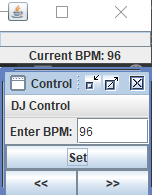

# 복합 패턴

하나의 디자인 문제를 해결하려 여러 패턴을 함께 사용하는 경우가 있는데요,

이처럼 반복적으로 생길 수 있는 일반적인 문제를 해결하는 용도로 
2개 이상의 패턴을 결합해서 사용하는 것을 복합패턴 이라고 합니다.

여러 패턴을 함께 사용해서 다양한 디자인 문제를 해결하는 방법을 복합 패턴 이라고 합니다.

복합 패턴이라 불리려면 여러가지 문제의 일반적인 해결법을 제시해야합니다.

대표적인 복합 패턴은 MVC 패턴이라고 합니다.

# MVC패턴 (Model-View-Controller)

- Model
    - 모든 데이터, 상태와 애플리케이션 로직이 들어있다.
    - View와 Controller에서 Model의 상태를 조작하거나 가져올 때 필요한 인터페이스 제공
    - 옵저버 패턴 사용
        - 상태 변경마다 View와 Controller에 연락
- View
    - Model을 표현하는 방법을 제공
    - 화면에 표시할 때 상태와 데이터는 Model에서 가져옴
    - 컴포지트 패턴 사용
        - 여러 단계로 겹쳐있는 윈도우, 패널, 버튼, 텍스트 레이블 등의 디스플레이 항목이 복합객체나 잎이 될 수 있음
        - 최상위 View 구성 요소에게만 화면 갱신 요청을 하면 됨.
    - Controller와 함께 전략패턴 사용
        - View 객체를 여러 전략을 써서 설정가능
        - View는 겉모습만 신경쓰고, 인터페이스 행동 결정은 Controller가
        - View를 Model로부터 분리하는데 도움
            
            (Model에게 요청을 처리 하는 역할을 Controller가 하기때문)
            
- Controller
    - 사용자로부터 입력을 받음
    - 받은 입력을 해석 후 Model에게 전달
    - View와 함께 전략패턴사용
- 특징
    - 사용자는  View에만 접속가능
        - 버튼을 누르는 등의 행동을 하면 View가 Controller에게 행동을 전달하고 Controller는 상황에 맞게 작업 처리
    - Controller가 Model에게 상태를 변경하라고 요청
        - 행동을 받고 해석 후 Model 조작 방법을 결정해줌
            
            (Controller가 View를 변경해 달라고 요청)
            
    - 상태가 변경되면 Model이 View에게 알림
        - Model에 있는 데이터,상태 등이 변경되면 View에게 알림
    - View가 Model에게 상태를 요청

## BPM 제어 도구 만들기

- Model
    - BeatModelInterface
        
        ```java
        package headfirst.designpatterns.combined.djview;
          
        public interface BeatModelInterface {
        	void initialize();
          
        	void on();
          
        	void off();
          
            void setBPM(int bpm);
          
        	int getBPM();
          
        	void registerObserver(BeatObserver o);
          
        	void removeObserver(BeatObserver o);
          
        	void registerObserver(BPMObserver o);
          
        	void removeObserver(BPMObserver o);
        }
        ```
        
        - 데이터, 상태 애플리케이션 로직 관리
        - 옵저버 사용(연락알리는 메소드 필요)
    - BeatModel
        
        ```java
        package headfirst.designpatterns.combined.djview;
        
        import java.util.*;
        import javax.sound.sampled.AudioSystem;
        import javax.sound.sampled.Clip;
        import java.io.*;
        import javax.sound.sampled.Line;
        
        public class BeatModel implements BeatModelInterface, Runnable {
        	List<BeatObserver> beatObservers = new ArrayList<BeatObserver>();
        	List<BPMObserver> bpmObservers = new ArrayList<BPMObserver>();
        	int bpm = 90;
        	Thread thread;
        	boolean stop = false;
        	Clip clip;
        
        	public void initialize() {
        		try {
        			File resource = new File("clap.wav");
        			clip = (Clip) AudioSystem.getLine(new Line.Info(Clip.class));
        			clip.open(AudioSystem.getAudioInputStream(resource));
        		}
        		catch(Exception ex) {
        			System.out.println("Error: Can't load clip");
        			System.out.println(ex);
        		}
        	}
        
        	public void on() {
        		bpm = 90;
        		//notifyBPMObservers();
        		thread = new Thread(this);
        		stop = false;
        		thread.start();
        	}
        
        	public void off() {
        		stopBeat();
        		stop = true;
        	}
        
        	public void run() {
        		while (!stop) {
        			playBeat();
        			notifyBeatObservers();
        			try {
        				Thread.sleep(60000/getBPM());
        			} catch (Exception e) {}
        		}
        	}
        
        	public void setBPM(int bpm) {
        		this.bpm = bpm;
        		notifyBPMObservers();
        	}
        
        	public int getBPM() {
        		return bpm;
        	}
        
        	public void registerObserver(BeatObserver o) {
        		beatObservers.add(o);
        	}
        
        	public void notifyBeatObservers() {
        		for(int i = 0; i < beatObservers.size(); i++) {
        			BeatObserver observer = (BeatObserver)beatObservers.get(i);
        			observer.updateBeat();
        		}
        	}
        
        	public void registerObserver(BPMObserver o) {
        		bpmObservers.add(o);
        	}
        
        	public void notifyBPMObservers() {
        		for(int i = 0; i < bpmObservers.size(); i++) {
        			BPMObserver observer = (BPMObserver)bpmObservers.get(i);
        			observer.updateBPM();
        		}
        	}
        
        	public void removeObserver(BeatObserver o) {
        		int i = beatObservers.indexOf(o);
        		if (i >= 0) {
        			beatObservers.remove(i);
        		}
        	}
        
        	public void removeObserver(BPMObserver o) {
        		int i = bpmObservers.indexOf(o);
        		if (i >= 0) {
        			bpmObservers.remove(i);
        		}
        	}
        
        	public void playBeat() {
        		clip.setFramePosition(0);
        		clip.start();
        	}
        	public void stopBeat() {
        		clip.setFramePosition(0);
        		clip.stop();
        	}
        
        }
        ```
        
- View
    - DJView
        
        ```java
        package headfirst.designpatterns.combined.djview;
            
        import java.awt.*;
        import java.awt.event.*;
        import javax.swing.*;
        
        public class DJView implements ActionListener,  BeatObserver, BPMObserver {
        	BeatModelInterface model;
        	ControllerInterface controller;
            JFrame viewFrame;
            JPanel viewPanel;
        	BeatBar beatBar;
        	JLabel bpmOutputLabel;
            JFrame controlFrame;
            JPanel controlPanel;
            JLabel bpmLabel;
            JTextField bpmTextField;
            JButton setBPMButton;
            JButton increaseBPMButton;
            JButton decreaseBPMButton;
            JMenuBar menuBar;
            JMenu menu;
            JMenuItem startMenuItem;
            JMenuItem stopMenuItem;
        
            public DJView(ControllerInterface controller, BeatModelInterface model) {	
        		this.controller = controller;
        		this.model = model;
        		model.registerObserver((BeatObserver)this);
        		model.registerObserver((BPMObserver)this);
            }
            
            public void createView() {
        		// Create all Swing components here
                viewPanel = new JPanel(new GridLayout(1, 2));
                viewFrame = new JFrame("View");
                viewFrame.setDefaultCloseOperation(JFrame.EXIT_ON_CLOSE);
                viewFrame.setSize(new Dimension(100, 80));
                bpmOutputLabel = new JLabel("offline", SwingConstants.CENTER);
        		beatBar = new BeatBar();
        		beatBar.setValue(0);
                JPanel bpmPanel = new JPanel(new GridLayout(2, 1));
        		bpmPanel.add(beatBar);
                bpmPanel.add(bpmOutputLabel);
                viewPanel.add(bpmPanel);
                viewFrame.getContentPane().add(viewPanel, BorderLayout.CENTER);
                viewFrame.pack();
                viewFrame.setVisible(true);
        	}
          
          
            public void createControls() {
        		// Create all Swing components here
                JFrame.setDefaultLookAndFeelDecorated(true);
                controlFrame = new JFrame("Control");
                controlFrame.setDefaultCloseOperation(JFrame.EXIT_ON_CLOSE);
                controlFrame.setSize(new Dimension(100, 80));
        
                controlPanel = new JPanel(new GridLayout(1, 2));
        
                menuBar = new JMenuBar();
                menu = new JMenu("DJ Control");
                startMenuItem = new JMenuItem("Start");
                menu.add(startMenuItem);
                startMenuItem.addActionListener((event) -> controller.start());
                // was....
                /*
                startMenuItem.addActionListener(new ActionListener() {
                    public void actionPerformed(ActionEvent event) {
                        controller.start();
                    }
                });
                */
                stopMenuItem = new JMenuItem("Stop");
                menu.add(stopMenuItem); 
                stopMenuItem.addActionListener((event) -> controller.stop());
                // was...
                /*
                stopMenuItem.addActionListener(new ActionListener() {
                    public void actionPerformed(ActionEvent event) {
                        controller.stop();
                    }
                });
                */
                JMenuItem exit = new JMenuItem("Quit");
                exit.addActionListener((event) -> System.exit(0));
                // was...
                /*
                exit.addActionListener(new ActionListener() {
                    public void actionPerformed(ActionEvent event) {
                        System.exit(0);
                    }
                });
                */
        
                menu.add(exit);
                menuBar.add(menu);
                controlFrame.setJMenuBar(menuBar);
        
                bpmTextField = new JTextField(2);
                bpmLabel = new JLabel("Enter BPM:", SwingConstants.RIGHT);
                setBPMButton = new JButton("Set");
                setBPMButton.setSize(new Dimension(10,40));
                increaseBPMButton = new JButton(">>");
                decreaseBPMButton = new JButton("<<");
                setBPMButton.addActionListener(this);
                increaseBPMButton.addActionListener(this);
                decreaseBPMButton.addActionListener(this);
        
                JPanel buttonPanel = new JPanel(new GridLayout(1, 2));
        
        		buttonPanel.add(decreaseBPMButton);
        		buttonPanel.add(increaseBPMButton);
        
                JPanel enterPanel = new JPanel(new GridLayout(1, 2));
                enterPanel.add(bpmLabel);
                enterPanel.add(bpmTextField);
                JPanel insideControlPanel = new JPanel(new GridLayout(3, 1));
                insideControlPanel.add(enterPanel);
                insideControlPanel.add(setBPMButton);
                insideControlPanel.add(buttonPanel);
                controlPanel.add(insideControlPanel);
                
                bpmLabel.setBorder(BorderFactory.createEmptyBorder(5,5,5,5));
                bpmOutputLabel.setBorder(BorderFactory.createEmptyBorder(5,5,5,5));
        
                controlFrame.getRootPane().setDefaultButton(setBPMButton);
                controlFrame.getContentPane().add(controlPanel, BorderLayout.CENTER);
        
                controlFrame.pack();
                controlFrame.setVisible(true);
            }
        
        	public void enableStopMenuItem() {
            	stopMenuItem.setEnabled(true);
        	}
        
        	public void disableStopMenuItem() {
            	stopMenuItem.setEnabled(false);
        	}
        
        	public void enableStartMenuItem() {
            	startMenuItem.setEnabled(true);
        	}
        
        	public void disableStartMenuItem() {
            	startMenuItem.setEnabled(false);
        	}
        
            public void actionPerformed(ActionEvent event) {
        		if (event.getSource() == setBPMButton) {
        			int bpm = 90;
        			String bpmText = bpmTextField.getText();
        			if (bpmText == null || bpmText.contentEquals("")) {
        				bpm = 90;
        			} else {
        				bpm = Integer.parseInt(bpmTextField.getText());
        			}
                	controller.setBPM(bpm);
        		} else if (event.getSource() == increaseBPMButton) {
        			controller.increaseBPM();
        		} else if (event.getSource() == decreaseBPMButton) {
        			controller.decreaseBPM();
        		}
            }
        
        	public void updateBPM() {
        		if (model != null) {
        			int bpm = model.getBPM();
        			if (bpm == 0) {
        				if (bpmOutputLabel != null) {
                			bpmOutputLabel.setText("offline");
        				}
        			} else {
        				if (bpmOutputLabel != null) {
                			bpmOutputLabel.setText("Current BPM: " + model.getBPM());
        				}
        			}
        		}
        	}
          
        	public void updateBeat() {
        		if (beatBar != null) {
        			 beatBar.setValue(100);
        		}
        	}
        }
        ```
        
        - 비트와 BPM상태 변경 시 연락을 받는 옵저버
        - 사용자 이터페이스 제어
            - Controller에게 할 일을 알려줌으로써 Model 제어
- Controller
    - ControllerInterface
        
        ```java
        package headfirst.designpatterns.combined.djview;
          
        public interface ControllerInterface {
        	void start();
        	void stop();
        	void increaseBPM();
        	void decreaseBPM();
         	void setBPM(int bpm);
        }
        ```
        
        View에서 쓰이는 전략 → View에 넣을 전략 객체의 인터페이스 필요
        
    - BeatController
        
        ```java
        package headfirst.designpatterns.combined.djview;
          
        public class BeatController implements ControllerInterface {
        	BeatModelInterface model;
        	DJView view;
           
        	public BeatController(BeatModelInterface model) {
        		this.model = model;
        		view = new DJView(this, model);
                view.createView();
                view.createControls();
        		view.disableStopMenuItem();
        		view.enableStartMenuItem();
        		model.initialize();
        	}
          
        	public void start() {
        		model.on();
        		view.disableStartMenuItem();
        		view.enableStopMenuItem();
        	}
          
        	public void stop() {
        		model.off();
        		view.disableStopMenuItem();
        		view.enableStartMenuItem();
        	}
            
        	public void increaseBPM() {
                int bpm = model.getBPM();
                model.setBPM(bpm + 1);
        	}
            
        	public void decreaseBPM() {
                int bpm = model.getBPM();
                model.setBPM(bpm - 1);
          	}
          
         	public void setBPM(int bpm) {
        		model.setBPM(bpm);
        	}
        }
        ```
        
- MVC합치기
    - DJTestDrive
        
        ```java
        package headfirst.designpatterns.combined.djview;
          
        public class DJTestDrive {
        
            public static void main (String[] args) {
                BeatModelInterface model = new BeatModel();
        				ControllerInterface controller = new BeatController(model);
            }
        }
        ```
      