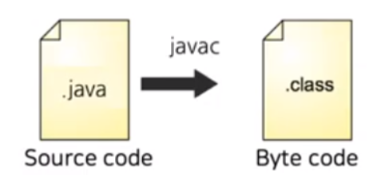

# Interpreter Pattern

> 한 언어에서 문법들을 평가하는 방법을 규정하는 디자인 패턴
> 
> 문법적 규칙을 클래스화 하여, 일련의 규칙을 통해 언어/문법을 해석하는 패턴
> >CS에서는 사람이 작성한 코드를 하드웨어가 이해할 수 있도록 변환해주는 장치를 인터프리터라고 한다.

어떤 언어의 인터프리터를 만들 때는 인터프리터 패턴을 사용하면 된다.

인터프리터의 좋은 예시는 자바소스 코드(.java)를 JVM이 이해할 수 있도록 바이트 코드로 바꿔주는 자바 컴파일러(javac)가 있다.

 (컴파일러가 바이트코드로 바꿔줘서 .class파일로 저장됨)
 출처 : https://www.youtube.com/watch?v=AWXPnMDZ9I0&t=1s

- 장점
    - 문법을 클래스로 표현해서 쉽게 언어를 구현 가능
    - 문법이 클래스로 표현되므로 언어를 쉽게 변경하거나 확장 가능
    - 클래스 구조에 메소드만 추가하면 프로그램을 해석하는 기본 기능 외에  
      예쁘게 출력하는 기능이나 더 나은 프로그램 확인 기능 같은 새로운 기능을 추가 가능
      

- 활용법
    - 간단한 언어를 구현할 때 인터프리터 패턴이 유용
    - 효율보다는 단순하고 간단하게 문법을 만드는 것이 더 중요한 경우에 유용
    - 스크립트 언어와 프로그래밍 언어에서 모두 사용 가능
    

- 단점
    - 문법 규칙의 개수가 많아지면 아주 복잡해진다.
         → 파서나 컴파일러 생성기를 쓰는 편이 나음
      
